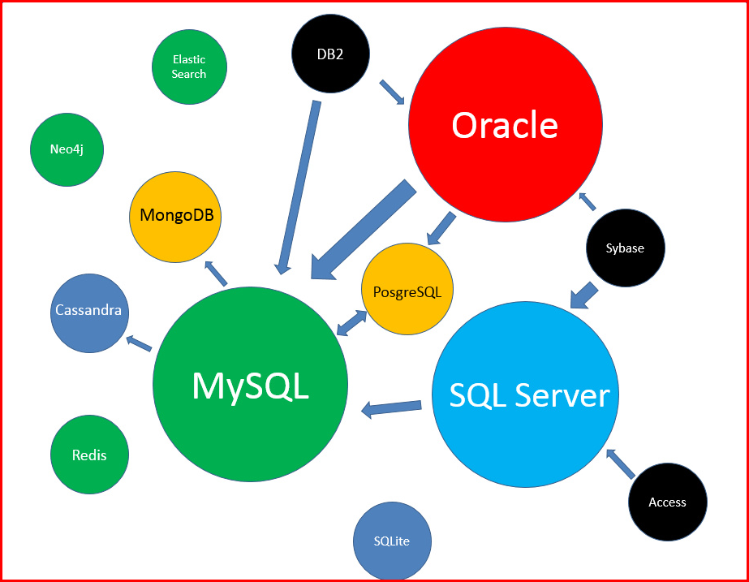
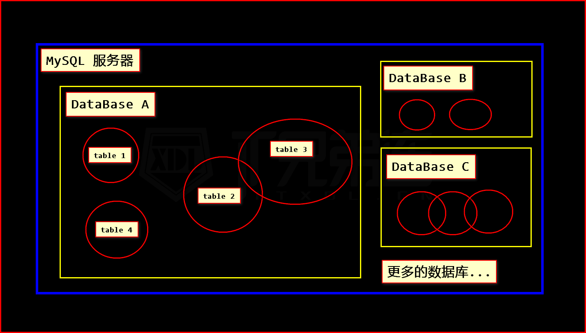
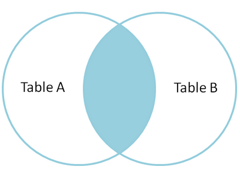

# 1. 数据库简介

## 1.1 什么是数据库？

> 生活中的数据库

- 存放衣服的 `衣柜`
- 超市门口存包的 `柜子`
- 停车场里的 `车位`
- 饭店里的 `菜单`

> 数据管理技术，经历了三个阶段

- 人工管理阶段
- 文件系统阶段
- 数据库系统阶段

## 1.2 各类数据库简介

- Oracle     (甲骨文，全球第二大软件公司)
- MySQL      (免费开源)
- SQL Server (Microsoft)
- MongoDB    (非关系型数据库)
- PostgreSQL (加州大学伯克利分校，对象关系数据库)
- DB2        (IBM 公司开发出来操作)
- Redis      (key-value的形式存储)
- SQLite     (微型数据库)

> 点我查看：[数据库排行](http://db-engines.com/en/ranking)



## 1.3 MySQL 关系型数据库

由瑞典 MySQL AB 公司开发，目前属于 Oracle 旗下产品。

MySQL 是一种关系数据库管理系统，关系数据库将数据保存在不同的表中，而不是将所有数据放在一个大仓库内，这样就增加了速度并提高了灵活性。

MySQL 所使用的 `SQL` 语言是用于访问数据库的最常用`标准化语言`。
MySQL 软件采用了双授权政策，分为`社区版`和`商业版`，由于其体积小、速度快、总体拥有成本低，尤其是开放源码这一特点，一般中小型网站的开发都选择 MySQL 作为网站数据库。

LAMP 中的 `M` 一般指的就是 MySQL，特点就是 开源免费。

> 什么是关系型数据库？
> 详见 `关系型数据库.xlsx` 文件。

## 1.4 SQL 语言

> SQL 是用于 访问和处理数据库的 标准的计算机语言。

我们将学习，如何使用 SQL 访问和处理数据系统中的数据
它可操作的数据库，包括但不限于：MySQL，Oracle，Sybase，SQL Server，DB2， Access 等等这些。

- SQL
    - Structured Query Language 结构化查询语言
    - 用于访问和处理 数据库的标准的计算机语言
- DDL Data Definition Language 数据定义语言
    - CREATE 创建
    - ALTER 修改
    - DROP 删除
    - 对库/表的操作
- DML
    - Data Manipulation Language 数据操作语言
    - INSERT 插入数据
    - DELETE 删除数据
    - UPDATE 更新数据
    - SELECT 查询数据
    - 对数据的操作
- DCL
    - Data Control Language 数据控制语言
    - GRANT 分配权限
    - REVOKE 收回权限
    - 行为操作

> 我们以 MySQL 语言为基础，来学习 SQL 语法。

----

# 2. 数据库配置及连接

## 2.1 安装数据库 + 启用数据库服务

> 详见 `install` 目录的安装文档 `readme.md`

## 2.2 登录和退出 MySQL 服务器

### 2.2.1 登录退出
```mysql
# 登录 MySQL，回车后输入密码
1.登录本地的MYSQL数据库：mysql -u root -p  

2.连接远程主机上的MYSQL数据库：mysql -h 192.168.191.2 -u root -p 123456
Enter password: ******

# 返回的 登录信息
Welcome to the MySQL monitor.  Commands end with ; or \g.
Your MySQL connection id is 55
Server version: 5.7.23 MySQL Community Server (GPL)

Copyright (c) 2000, 2018, Oracle and/or its affiliates. All rights reserved.

Oracle is a registered trademark of Oracle Corporation and/or its
affiliates. Other names may be trademarks of their respective
owners.

Type 'help;' or '\h' for help. Type '\c' to clear the current input statement.

# 退出登录
mysql> exit;
```

### 2.2.2 参数说明

```shell
mysql 登录参数说明：
    -h  主机名 localhost
    -u  用户名 root
    -p  密码   123456
    注意：参数无需加空格，直接写值即可。

对比说明，以下命令的区别：
$ mysql -hlocalhost -uroot -p123456
$ mysql -uroot -p123456
$ mysql -uroot -p
```

### 2.2.3 登录信息说明

```shell
# 欢迎来到 Mysql 监控，命令结束符 使用 分号 或 \g
Welcome to the MySQL monitor.  Commands end with ; or \g.
# 你的第 x 次 MySQL 数据库连接，每次开机从 0 开始
Your MySQL connection id is 55
# MYSQL版本，社区版本
Server version: 5.7.23 MySQL Community Server (GPL)
# 版权所有，甲骨文及其附属公司保留所有权利
Copyright (c) 2000, 2018, Oracle and/or its affiliates. All rights reserved.
# 商标所有权说明
Oracle is a registered trademark of Oracle Corporation and/or its
affiliates. Other names may be trademarks of their respective
owners.
# 帮助信息 help 或 \h 。
# \c 清除当前的输入状态，清除当前未执行的命令
Type 'help;' or '\h' for help. Type '\c' to clear the current input statement.
```

总结以上得到：
1. 每个 SQL 命令，都需要使用 `;`(分号) 或 `\g` 来完成
2. 可以将一行命令 拆成多行
3. 可以通过`\c` 来取消 本行命令
4. 可以通过`\q`、`exit`、`quit`来退出当前客户端

> 此外，我们还能通过使用`help`命令，来查询快捷键

常用如下：
- `\G` 将命令发送到 mysql 服务器，以行方式 显示结果
    - DOS窗口有宽度,查询结果 出现的位置 会比较乱.
    - 要想正常查看 结果的内容,可用 \G 来按行输出.
- `\c` 取消当前未完成的操作
- `\q` 退出当前客户端
- `\s` 显示当前服务器状态
- `\h` (同help命令) 显示帮助信息
- `\d` 更改执行符

> MySQL系统命令，不区分大小写。
>
> 为了方便区分，MySQL 命令建议大写，
>
> 自己定义的库名、表名、字段名等等，建议小写。

### 2.2.4 连接远端数据库[可选]

----

# 3. 数据库和数据表

首先，要明确一个概念： （见下图）



## 3.1 数据库的操作

### 3.1.1 查看数据库

```mysql
# 查看数据库们
mysql> SHOW DATABASES;

# 返回类似 以下信息：
+--------------------+
| Database           |
+--------------------+
| information_schema |
| mysql              |
| test               |
+--------------------+
3 rows in set (0.00 sec)
```

### 3.1.2 创建数据库
```mysql
# IF NOT EXISTS：数据库不存在 才创建（可选）
mysql> CREATE DATABASE IF NOT EXISTS `库名`;

CREATE DATABASE IF NOT EXISTS `s91`;

> Query OK, 1 row affected (0.02 sec)
```

### 3.1.3 删除数据库
```mysql
# IF EXISTS：数据库存在 才删除（可选）
mysql> DROP DATABASE IF EXISTS `库名`;

DROP DATABASE IF EXISTS `s91`;

> Query OK, 0 rows affected (0.02 sec)
```

### 3.1.4 选择数据库
```mysql
# 选择数据库
mysql> USE `库名`;

USE `s91`;

> Database changed
# 要使用数据库,就必须先选择某个数据库。

# 查看当前选中的库
select database();
```

----

## 3.2 数据表的操作

### 3.2.1 查看数据表

```mysql
# 查看数据表
mysql> SHOW TABLES;

# 无数据表，则返回
> Empty set (0.00 sec)

# 有数据表，则输出数据表表名
+----------------+
| Tables_in_test |
+----------------+
| user           |
+----------------+
1 rows in set (0.00 sec)
```

### 3.2.2 创建数据表

```mysql
# 创建数据表语法
CREATE TABLE IF NOT EXISTS `表名`(
    # 字段及属性
)ENGINE=InonDB DEFAULT CHARSET=UTF8mb4;

# 创建 user 表
CREATE TABLE IF NOT EXISTS `user`(
    `id`    INT,
    `name`  VARCHAR(255),
    `sex`   TINYINT,
    `age`   TINYINT UNSIGNED,
    `tel`   CHAR(11)
)ENGINE=InnoDB DEFAULT CHARSET=UTF8mb4;

> Query OK, 0 rows affected (0.06 sec)
```

> 欲知具体规则，请听下回分解~

### 3.2.3 查看表结构
```mysql

# 查看数据表 表结构方式一：
mysql> DESC `表名`;

DESC `user`;

+-------+---------------------+------+-----+---------+-------+
| Field | Type                | Null | Key | Default | Extra |
+-------+---------------------+------+-----+---------+-------+
| id    | int(11)             | YES  |     | NULL    |       |
| name  | varchar(255)        | YES  |     | NULL    |       |
| sex   | tinyint(4)          | YES  |     | NULL    |       |
| age   | tinyint(3) unsigned | YES  |     | NULL    |       |
| tel   | char(11)            | YES  |     | NULL    |       |
+-------+---------------------+------+-----+---------+-------+
5 rows in set (0.00 sec)


# 查看数据表 表结构方式二：
mysql> DESC `表名`\G

DESC `user`\G

*************************** 1. row ***************************
  Field: id
   Type: int(11)
   Null: YES
    Key:
Default: NULL
  Extra:
# [...省略中间部分...]
*************************** 5. row ***************************
  Field: tel
   Type: char(11)
   Null: YES
    Key:
Default: NULL
  Extra:
5 rows in set (0.00 sec)


# 查看数据表 表结构方式三：
mysql> DESCRIBE `表名`;

DESCRIBE `user`;
# 结果同第一种方式一致。

# 查看数据表 表结构方式四：
mysql> SHOW CREATE TABLE `表名`\G

SHOW CREATE TABLE `user`\G

*************************** 1. row ***************************
       Table: user
Create Table: CREATE TABLE `user` (
  `id` int(11) DEFAULT NULL,
  `name` varchar(255) DEFAULT NULL,
  `sex` tinyint(4) DEFAULT NULL,
  `age` tinyint(3) unsigned DEFAULT NULL,
  `tel` char(11) DEFAULT NULL
) ENGINE=InnoDB DEFAULT CHARSET=utf8
1 row in set (0.00 sec)
```

### 3.2.4 删除数据表

```mysql
# 删除数据表
mysql> DROP TABLE IF EXISTS `表名`;

DROP TABLE IF EXISTS `user`;

> Query OK, 0 rows affected (0.02 sec)
```

----

# 4. CURD 操作（增、删、改、查）
> CURD 是一个数据库技术中的缩写词，一般的项目开发的各种参数的基本功能都是 CURD。
>
> 它代表 创建（Create）、 更新（Update） 、 读取（Read） 和 删除（Delete） 操作。

## 4.1 添加数据

### 4.1.1 添加单条数据

```mysql
# 字段名 使用反引号包裹，插入的值 使用单/双引号包裹

# 1). 为表的 【所有字段】 插入数据
# 必须列出所有 字段的值
mysql> INSERT INTO `表名` VALUES ('值1','值2'...'值N');

# 列出所有 字段 和 值，根据指定的 字段顺序，赋值相应的 字段值
mysql> INSERT INTO `表名` (`字段1`,`字段2`...`字段N`) VALUES ('值1','值2'...'值N');

# 2). 为表的 【指定字段】 插入数据
# 根据指定的 字段顺序，赋值相应的 字段值
mysql> INSERT INTO `表名` (`字段1`,`字段2`) VALUES ('值1','值2');
```

### 4.1.2 添加多条数据insert

```mysql
# 列出所有的 字段的值，多个值之间 用逗号隔开。
mysql> INSERT INTO `表名` VALUES
('值1','值2'...'值N'),
('值1','值2'...'值N'),
('值1','值2'...'值N');

# 指定字段的 多条插入
mysql> INSERT INTO `表名` (`字段1`,`字段2`) VALUES
('值1','值2'),
('值1','值2'),
('值1','值2');

# 将查询结果插入到表中
mysql> INSERT INTO `表名1` (字段列表1) SELECT 查询字段列表 FROM `表名2` [WHERE 条件表达式];
```

## 4.2 查询数据 (基本版)select

```mysql
# 查询某表 全部的数据
mysql> SELECT * FROM `表名`;

# 查询某表中 某些字段的数据
mysql> SELECT `字段1`,`字段2` FROM `表名`;

# 查询指定记录
mysql> SELECT `字段1`,`字段2` FROM `表名` WHERE `字段`='值';
```

## 4.3 更新数据update

```mysql
# 更新满足条件数据的字段值
mysql> UPDATE `表名`
SET `字段1`='新值1',`字段2`='新值2'...`字段N`='新值N'
WHERE 条件表达式;

# PS. 更新数据，一定要设置"WHERE"条件，否则更新整表数据！！
```

## 4.4 删除数据delete

### 4.4.1 删除指定数据
```mysql
# 删除满足条件的数据
mysql> DELETE FROM `表名` WHERE 条件表达式;

# 删除数据，一定要设置"WHERE"条件，否则删除整表数据！！
```

### 4.4.2 清空表数据

```mysql
TRUNCATE TABLE `表名`;
```

----

# 5. 导入/导出 数据表

> 此操作需要在`没有登录 MySQL`的状态下进行。

## 5.1 导出数据

```shell
# 导出 指定数据库
$ mysqldump -u用户名 -p  库名 > 保存SQL文件.sql
# 密码会在 回车后输入

# 导出 指定数据库里 指定的表
$ mysqldump -u root -p 库名 表名1 表名2 > Backup.sql
```

## 5.2 导入数据
```shell
$ mysql -u用户名 -p 库名 < SQL文件.sql
```

## 5.3 使用工具操作 导入/导出

还可以使用软件或工具，来便捷的实现数据导入/导出操作
- [phpMyAdmin](https://www.phpmyadmin.net/)
- [Navicat](https://www.navicat.com.cn/)
- IEDA 编辑器

----

# 6. 修改密码

登陆 MySQL 修改 root 密码（WAMP 默认是无密码）
其原理就是替换 `mysql`.`user` 中 `root` 用户的密码字段值

## 6.1 可以登陆时 正常修改密码

```mysql
# 登陆 MySQL
$ mysql -u root -p

# 使用 mysql 数据库
mysql> use mysql;

# 新密码必须使用`password()`加密函数 进行加密，并更新到 mysql 数据库的密码字段

# MySQL 5.7 以前版本，密码字段为 Password
mysql> UPDATE `user` SET `Password`=password('new_password') WHERE `user`='root';

# MySQL 5.7 以后版本，Password 字段改为了 authentication_string
mysql> UPDATE `user` SET `authentication_string`=password('new_password') WHERE `user`='root';

# 刷新 MySQL 的系统权限相关表
mysql> flush privileges;

# 退出
mysql> exit;
```

## 6.2 无法登陆时 强制修改

1. 关闭 MySQL 服务
2. 打开 DOS 窗口，进入到 MySQL 下的 **`bin`**目录
3. 输入执行**`mysqld --skip-grant-tables` **
   - 意思为，启动 MySQL 服务的时候，跳过权限表认证，即跳过密码验证
   - 此时 DOS 窗口 已经不能动了，它已经占用 3306 端口了
   - 此窗口**`勿关`**

4. 再开一个 DOS 窗口，输入**`mysql`**回车，如果执行成功，将出现 MySQL 提示符
5. 选择连接权限数据库 **`use mysql`**
   - 可以输入 `select * from user\G` 查看`user`内的数据情况
6. 强制修改密码：
   - 5.7+（注意修改你的新密码）
     - **`UPDATE user SET authentication_string=password("你的新密码") WHERE user="root";`**
   - 5.7-（注意修改你的新密码）
     - `UPDATE user SET password=password("你的新密码") WHERE user="root";`
7. 刷新权限：**`flush privileges;`**
8. 退出所有DOS窗口，并**重启 MySQL 服务**，使用新密码登录

----

# 7. 分配权限

```mysql
# 授权
GRANT 权限            (SELECT,INSERT,UPDATE,DELETE)
ON 哪个库.哪个表       (*.*  表示 全部库 全部表)
TO 用户名@'登陆主机'   (登录主机 `%` 表示 任何 IP 皆可)
IDENTIFIED BY '密码'  (密码)

# 刷新权限
flush privileges;

# 收回权限
REVOKE 权限                (收回什么权限)
ON 哪个库.哪个表            (指定库/表)
FROM '用户名'@'登陆主机';   (谁在哪个IP收回)

# 删除用户
DROP USER '用户名'@'登陆主机';
```

----

# PS. 补充说明

学习时，解决 mysql 内存，占用过高问题
将以下两行 写入 `my.ini` 配置文件，并重启 MySQL 服务

```ini
table_open_cache=256
table_definition_cache=400
```


# 8. MySQL 数据表的设计

## 8.1 MySQL 建表语句

```mysql
# 建表语句
CREATE TABLE [IF NOT EXISTS] `表名`(
    `字段名1` 数据类型 [字段属性],
    `字段名2` 数据类型 [字段属性],
    ...
    `字段名N` 数据类型 [字段属性]
)[表引擎=引擎名] [DEFAULT CHARSET=utf8mb4];
```

## 8.2 建表语句的含义与注意事项

1. 表名反引号，可区别屏蔽 系统关键字
2. 表引擎，详见 `8.3 表引擎说明`
   - ENGINE = MyISAM
   - ENGINE = InnoDB [默认,推荐]
3. 字符集 `DEFAULT CHARSET=utf8`，常见值为
   - `utf8` Unicode 字符集
   - `gbk` 文字编码是用双字节来表示
   - `utf8mb4` （推荐）更大的字符集，存储生僻字，颜文字表情
4. 字段名加上反引号，字段之间用逗号分隔。
5. 最后一个字段的后面，不能有逗号。
6. 字段名要有相应的字段类型，也就是数据类型，字段属性可选。

## 8.3 MySQL 表引擎说明

> MySQL的引擎有很多, 下面只介绍两个常用的：`MyISAM` 和 `InnoDB`

|          | MyISAM                                                       | InnoDB                                                |
| :------- | :----------------------------------------------------------- | :---------------------------------------------------- |
| 事务     | No                                                           | Yes                                                   |
| 全文索引 | Yes                                                          | No （可用 Sphinx 代替）                               |
| 表总行数 | 存储 <br>count() 可直接获取 <br>count() 若带where条件, 则会遍历整表, 消耗巨大 | 未存储 <br>当场遍历整表, 消耗巨大                     |
| CURD     | 擅长 R <br>查询数据                                          | 擅长 C、U、D <br>增、删、改                           |
| 行表锁   | 表锁 <br>开销小, 加锁快, 低并发                              | 行锁 (默认) , 表锁 <br>开销大, 加锁慢, 易死锁, 高并发 |

## 8.4 MySQL 字段属性说明

| 字段属性       | 属性名   | 描述                                                         |
| -------------- | -------- | ------------------------------------------------------------ |
| UNSIGNED       | 无符号   | 没有正负号，即没有负数                                       |
| AUTO_INCREMENT | 自增     | 每新增一条数据，该字段值 +1<br>**根据记录 +1，而非已有最大值 +1**<br>不允许重复<br>常配合主键使用 |
| ZEROFILL       | 零填充   | 显示宽度不足时，高位用 0 代替<br>**自动加上 unsigned 属性**  |
| DEFAULT        | 默认值   | 没有给该字段赋值时，则自动采用默认值                         |
| NOT NULL       | 非空约束 | 该字段必须有值                                               |
| NULL           | 空约束   | 该字段可以不赋值                                             |
| COMMENT        | 注释描述 | 描述字段的功能（常用于：开关/状态的说明）                    |
| PRIMARY KEY    | 主键索引 | 主键数据**不能为空**<br>主键数据**不能重复**<br>主键**不能重复设置**<br>常配合自增使用 |
| UNIQUE         | 唯一索引 | 索引数据**不能重复**<br>索引**可以设置多个**<br>索引可以**提高查询速度**<br>占用磁盘空间<br>索引**不宜太多**（消耗空间，消耗性能） |

> 表内最后两项为`索引类型`
>
> 以上的 字段属性 和 索引类型 会在后续示例中讲解。
>
> 

----

## 8.5指定数自增

https://www.cnblogs.com/yy3b2007com/p/11674844.html

方案1、使用alter table `tablename` AUTO_INCREMENT=10000

```mysql
CREATE TABLE `trace_test` (
  `id` int(11) NOT NULL AUTO_INCREMENT,
  `name` varchar(255) DEFAULT NULL,
  PRIMARY KEY (`id`)
) ENGINE=InnoDB DEFAULT CHARSET=utf8 ;

alter table `trace_test` AUTO_INCREMENT=10000;
```

方案2、创建表时设置AUTO_INCREMENT 10000参数

```mysql
CREATE TABLE `trace_test` (
  `id` int(11) NOT NULL AUTO_INCREMENT,
  `name` varchar(255) DEFAULT NULL,
  PRIMARY KEY (`id`)
) ENGINE=InnoDB AUTO_INCREMENT 10000 DEFAULT CHARSET=utf8 ;
```

以指定从1000开始为例。
1 创建表的时候就设置：


2 如果在创建表时没有设置，后来想设置，可以通过修改实现：

```mysql

```


# 9. MySQL 数据类型

## 9.0 数据类型说明

> MySQL 中常用的数据类型主要有四种，见下表

| 数据类型           | 说明                                                  |
| ------------------ | ----------------------------------------------------- |
| 数值数据类型       | 支持多种数值类型，且取值范围不同：整型、浮点型        |
| 串数据类型         | 最常用，多用于：定长字串、变长字串                    |
| 日期和时间数据类型 | 具有格式化的：时间、日期                              |
| 二进制数据类型     | 可存储任何数据，包括二进制信息：图像，音/视频，文档等 |

## 9.1 整型

| 类型      | 字节 | 无符号范围               | 有符号的范围                                   | 数量级说明 |
| --------- | :--: | ------------------------ | ---------------------------------------------- | ---------- |
| TINYINT   |  1   | 0 ~ 255                  | -128 ~ +127                                    | 百级别     |
| SMALLINT  |  2   | 0 ~ 65535                | -32768 ~ +32767                                | 万级别     |
| MEDIUMINT |  3   | 0 ~ 16777215             | -8388608 ~ +8388607                            | 千万级别   |
| INT       |  4   | 0 ~ 4294967295           | -2147483648 ~ +2147483647                      | 几十亿级别 |
| BIGINT    |  8   | 0 ~ 18446744073709551615 | -9223372036854775808 ~<br>+9223372036854775807 | 千G级别    |

### 9.1.1 类型规则

- 不同的整型类型`占用空间`是不同的。
- 输入值在合理范围内，不论值是多少，都占同样的存储空间。
- 表示范围，默认都是`有符号的`表示范围。
- `无符号`由字段属性 `UNSIGNED` 来决定。

```mysql
# 测试整数的范围,及`unsigned`的使用
# 创建`test0`表
CREATE TABLE `test0`(
    `num` TINYINT
)engine=InnoDB default charset=utf8mb4;

# 创建好之后 查看表结构
DESC `test0`;

# 创建`test1`表
CREATE TABLE `test1`(
    `num` TINYINT UNSIGNED
)engine=InnoDB default charset=utf8mb4;

# 创建好之后 查看表结构
DESC `test1`;

# 添加 测试数据
INSERT INTO `test0` VALUES(50);
INSERT INTO `test0` VALUES(-30);
INSERT INTO `test0` VALUES(-300);
INSERT INTO `test0` VALUES(300);

INSERT INTO `test1` VALUES(50);
INSERT INTO `test1` VALUES(-30);
INSERT INTO `test1` VALUES(300);

# 查询测试以上数据
```

> PS. 警告提示，根据实际情况修改一下参数。

```ini
5.7 版本的 MySQL 对字段值 会严格检查：
插入越界值、某些非空值、插入时没有给值，都会报错！！！

可更改`my.ini`配置文件，并重启服务
将`sql-mode`注释，并改为以下:
sql-mode = "NO_AUTO_CREATE_USER,NO_ENGINE_SUBSTITUTION"

修改后,重新登录 mysql 命令行 才可以继续操作
```

> 我们为了节省空间 和 提高数据处理的效率。
> 就要根据 具体的应用数据，来设定相应的数据类型。

### 9.1.2 显示宽度 与 零填充

> `整数类型(n)` ：n - 显示宽度    如: INT(11)

- 显示宽度可以与`ZEROFILL 零填充`配合使用。
  - 如果加上此属性，字段内会自动加上`UNSIGNED`属性。
- 显示宽度与存储字节`无关`。
  - 插入的数据宽度`大于`设置的宽度，并在有效范围内，依旧会插入成功。
  - 插入的数值`范围超限`，则会报错。

```mysql
# 测试 显示宽度 / 零填充 ZEROFILL
# 创建`test2`表
CREATE TABLE `test2`(
    `num` INT(5) ZEROFILL
)ENGINE=InnoDB DEFAULT CHARSET=utf8mb4;

# 建表，并查看表结构
DESC `test2`;

# 测试数据
INSERT INTO `test2` VALUES(300);
INSERT INTO `test2` VALUES(8);

# 查询测试以上数据
SELECT * FROM test2;
+-------+
| num   |
+-------+
| 00300 |
| 00008 |
+-------+
2 rows in set (0.00 sec)

# 插入超过显示宽度的合理范围值
INSERT INTO `test2` VALUES(88888888);

# 查询测试以上数据
```

### 9.1.3 自增 与 主键索引

- 主键索引：`PRIMARY KEY`
  - 一个表内只能有一个字段使用 AUTO_INCREMENT，且该字段必须为主键。
  - 主键的值 `不能重复`。
  - 数据表会根据`主键的唯一性`，来唯一标识每一条记录。
  - 该字段的值，默认是从`1`开始自增的。
  - 该字段的值不能为空。一般配合整型一起使用。
- 自增：`AUTO_INCREMENT`
  - 创建表时只定义自增，会报错！
  - 自增字段，必须要配合`PRIMARY KEY`使用。

```mysql
# 测试 `auto_increment`(自增) / `primary key`(主键)
# 创建`test3`表
CREATE TABLE `test3`(
    `id` INT UNSIGNED PRIMARY KEY AUTO_INCREMENT,
    `name` VARCHAR(255)
)ENGINE=InnoDB DEFAULT CHARSET=utf8mb4;

# 查看表结构
DESC `test3`;

+-------+------------------+------+-----+---------+----------------+
| Field | Type             | Null | Key | Default | Extra          |
+-------+------------------+------+-----+---------+----------------+
| id    | int(10) unsigned | NO   | PRI | NULL    | auto_increment |
| name  | varchar(255)     | YES  |     | NULL    |                |
+-------+------------------+------+-----+---------+----------------+
2 rows in set (0.00 sec)

# 插入测试数据
# 可以 不用写 id 值,因为是自增,也可以填入 null
INSERT INTO `test3` (`name`) VALUES
('user1'), ('user2'), ('user3'), ('user4'),
('user5'), ('user6'), ('user7'), ('user8'),
('user9'), ('user10');

# 查看数据
SELECT * FROM `test3`;

# id 自增且连续
+----+--------+
| id | name   |
+----+--------+
|  1 | user1  |
|  2 | user2  |
|  3 | user3  |
|  4 | user4  |
|  5 | user5  |
|  6 | user6  |
|  7 | user7  |
|  8 | user8  |
|  9 | user9  |
| 10 | user10 |
+----+--------+
10 rows in set (0.00 sec)

# 删除全部数据
DELETE FROM `test3`;

# 查询 test3 数据为空
# 再插入一条数据
INSERT INTO `test3` (`name`) VALUES ('伊利丹');

# 查看数据 ID 为 11
SELECT * FROM `test3`;

# 查询当前最大ID
select last_insert_id();
```

PS. 自增归零的三种方式：

- TRUNCATE TABLE 表名; # 清空数据表
- 直接重置`auto_Increment`的值 (对 MyISAM 引擎起效)
  - `ALTER TABLE 表名 AUTO_INCREMENT = 1;`
- 删表，调整数据，重新构建.

> 不建议重置 主键的自增.

----

## 9.2 浮点型

| 类型         |       字节       | 范围（有符号）                                               | 范围（无符号）                                               |
| ------------ | :--------------: | ------------------------------------------------------------ | ------------------------------------------------------------ |
| FLOAT        |        4         | (-3.402 823 466 E+38，-1.175 494 351 E-38)，0，(1.175 494 351 E-38，3.402 823 466 351 E+38) | 0，(1.175 494 351 E-38，3.402 823 466 E+38)                  |
| DOUBLE       |        8         | (-1.797 693 134 862 315 7 E+308，-2.225 073 858 507 201 4 E-308)，0，(2.225 073 858 507 201 4 E-308，1.797 693 134 862 315 7 E+308) | 0，(2.225 073 858 507 201 4 E-308，1.797 693 134 862 315 7 E+308) |
| DECIMAL(M,D) | M>D则M+2 否则D+2 | 依赖于M和D的值                                               | 依赖于M和D的值                                               |

### 9.2.1 类型规则

- 不同的浮点类型`占用空间`是不同的。
- 输入值在合理范围内，不论值是多少，都占同样的存储空间。
- 表示范围，默认都是`有符号的`表示范围。
- `无符号`由字段属性 `UNSIGNED` 来决定。

### 9.2.2 使用说明

不管是`单精度浮点数(FLOAT)`还是`双精度浮点数(DOUBLE)`
通常是用来保存一些数量特别大，大到可以不用那么精确的数据。

> 如果要更精确的数据，请务必使用`定点数(DECIMAL)`。

```mysql
DECIMAL(M,D)
    M - 精度，是数据的总长度，小数点不占用长度
    D - 标度，小数点后的长度
# 我们一般使用定点数`DECIMAL`来表示小数
# 占有长度：如果 M>D 则为 M+2; 否则为 D+2

# 测试 decimal
# 创建`test4`表
CREATE TABLE `test4`(
    `price` DECIMAL(10,2)
)ENGINE=InnoDB DEFAULT CHARSET=utf8mb4;

# 查看表结构
DESC `test4`;

# 测试数据
INSERT INTO `test4` VALUES('100');
INSERT INTO `test4` VALUES('12345678');
INSERT INTO `test4` VALUES('998.9');
# 超范围数值
INSERT INTO `test4` VALUES('123456789');
# 超标度
INSERT INTO `test4` VALUES('123.456');
INSERT INTO `test4` VALUES('123.999');

# 查询测试以上数据
```

----

## 2.3 字符串类型

| 类型       | 大小                | 用途             |
| :--------- | ------------------- | :--------------- |
| CHAR       | 0 - 255 字节        | 定长字符串       |
| VARCHAR    | 0 - 65535 字节      | 变长字符串       |
| TINYTEXT   | 0 - 255 字节        | 短文本字符串     |
| TEXT       | 0 - 65535 字节      | 长文本数据       |
| MEDIUMTEXT | 0 - 16777215 字节   | 中等长度文本数据 |
| LONGTEXT   | 0 - 4294967295 字节 | 极大文本数据     |

----

### 9.3.1 CHAR 与 VARCHAR

- `CHAR(n)`    固定长度 字符类型
  - 指定`n`为多少 就占用多少空间
  - 能够使用 char 的时候，尽量使用 char
- `VARCHAR(n)` 可变长度 字符类型
  - 占用空间 根据实际长度 `n+1`
  - `n`:
    - 5.0 版本以前 长度范围是 `0~255`;
    - 5.0 版本以后 长度范围是 `0~65535`;
    - 注意 utf8 字符集，VARCHAR 的长度会缩水，详见 : [说明](https://www.cnblogs.com/gomysql/p/3615897.html)

> CHAR(5) 和 VARCHAR(5) 的区别

|  插入值  | CHAR 占用字节数 | VARCHAR 占用字节数 |
| :------: | :-------------: | :----------------: |
|    ''    |        5        |         1          |
|   '1'    |        5        |         2          |
|  '123'   |        5        |         4          |
| '12345'  |        5        |         6          |
| '123456' |        5        |         6          |

以上表中，最后一行中 多余的字符会被截取。
如果插入值的长度 大于(n)，只插入限定的长度部分，其余会被截取。

----

```mysql
# 测试 varchar 和 char
# 创建`test5`表
# name 唯一不可重复，且密码定长不为空
CREATE TABLE `test5`(
    `name` VARCHAR(255) UNIQUE,
    `pwd` CHAR(32) NOT NULL
)ENGINE=InnoDB DEFAULT CHARSET=utf8mb4;

# UNIQUE 唯一索引,一个表内 可以有多个 唯一索引.
# NOT NULL 值不得为空

# 查看表结构
DESC `test5`;

+-------+--------------+------+-----+---------+-------+
| Field | Type         | Null | Key | Default | Extra |
+-------+--------------+------+-----+---------+-------+
| name  | varchar(255) | YES  | UNI | NULL    |       |
| pwd   | char(32)     | NO   |     | NULL    |       |
+-------+--------------+------+-----+---------+-------+
2 rows in set

# 插入测试数据
# md5() 为 mysql 的加密函数，可加密成 32 位的字串
INSERT INTO `test5` (`name`,`pwd`) VALUES('马小云', md5('123456'));
INSERT INTO `test5` (`name`,`pwd`) VALUES('seeker', md5('123456'));

# 查询测试以上数据
```

### 9.3.2 TEXT 类型

2.3 表中，除了 CHAR 与 VARCHAR 以外的类型，一般都认为是 TEXT 类型。
占用空间 一般是 `文本长度+2字节`
用于表示大段的文本。如：小说、网页源码 等等

----

### 9.3.3 ENUM 类型

ENUM 类型，又称`枚举类型`，属于串类型，功能是在多个值之间选一个值。

> 百里挑一

```mysql
ENUM('值1', '值2', ..., '值N')
    ENUM 类型的值 只能获取列表中的 一个元素
    取值列表中 最多能有`65535字节`组成成员

# 测试 ENUM
# 创建`test6`表
CREATE TABLE `test6`(
    `sex` ENUM('man','woman','two-in-one')
)ENGINE=InnoDB DEFAULT CHARSET=utf8mb4;

# 查看表结构
DESC `test6`;

# 测试数据
INSERT INTO `test6` VALUES('man');
INSERT INTO `test6` VALUES('woman');
INSERT INTO `test6` VALUES('two-in-one');
INSERT INTO `test6` VALUES('hehe');

# 查询测试以上数据
```

### 9.3.4 SET 类型

SET 类型，属于串类型，功能是在多个值之间选一个获多个值。

> 百里挑N

```mysql
SET('值1', '值2', ..., '值n')
    取值可以是 其中的一个或多个
    SET 类型的值 最多能有`65535字节`组成成员

# 测试 SET
# 创建`test7`表
CREATE TABLE `test7`(
    `hobby` SET('man','woman','ps','ml','knvb')
)ENGINE=InnoDB DEFAULT CHARSET=utf8mb4;

# 查看表结构
DESC `test7`;

# 测试数据  不存在的值 就添加不到表里
INSERT INTO `test7` VALUES('man,woman,ps');
INSERT INTO `test7` VALUES('woman,knvb,haha');

# 查询测试以上数据
```

----

## 9.4 日期和时间型

| 日期类型  | 字节 | 日期格式            | 最小值     | 最大值     | 零值       |
| :-------: | :--: | ------------------- | ---------- | ---------- | ---------- |
|   DATE    |  4   | YYYY-MM-DD          | 1000-01-01 | 9999-12-31 | 0000-00-00 |
|   TIME    |  3   | HH:MM:SS            | 00:00:00   | 23:59:59   | 00:00:00   |
|   YEAR    |  1   | YYYY                | 1901       | 2155       | 0000       |
| DATETIME  |  4   | DATE 和 TIME 的组合 | ---        | ---        | ---        |
| TIMESTAMP |  8   | 功能与DATETIME相同  | 但范围较小 | ---        | ---        |

> 每个时间类型都有 一个  有效值范围 和 一个 "零"值
>
> 当指定不合法的 MySQL 不能表示的值时使用"零"值。
>
> > `TIMESTAMP` :
> > 结束时间是第 `2147483647` 秒,
> > 北京时间 `2038-1-19 11:14:07`，格林尼治时间 `2038-1-19 03:14:07`

----

## 9.5 二进制数据

| 类型       | 大小                | 用途                                       |
| :--------- | ------------------- | :----------------------------------------- |
| TINYBLOB   | 0 - 255 字节        | 不超过 255 个字符的二进制字符串            |
| BLOB       | 0 - 65535 字节      | 二进制形式的长文本数据 （最大为64KB）      |
| MEDIUMBLOB | 0 - 16777215 字节   | 二进制形式的中等长度文本数据（最大为16MB） |
| LONGBLOB   | 0 - 4294967295 字节 | 二进制形式的极大文本数据（最大为4GB）      |

> 在数据库中存储二进制数据的数据类型,类似于 text
> 如图像、音视频、各类文档等等

## 9.6 DEFAULT 默认值

> 详见 9.4 部分的表格说明

```mysql
# 测试 DEFAULT
# 创建`test8`表
CREATE TABLE `test8`(
    `str` VARCHAR(255) NOT NULL DEFAULT 'haha',
    `str1` VARCHAR(255)
)ENGINE=InnoDB DEFAULT CHARSET=utf8mb4;

# 查看表结构
DESC `test8`;

# 测试数据 只指定str1的值,不提供str字段值 就是用默认值
INSERT INTO `test8`(`str1`) VALUES('a');
INSERT INTO `test8`(`str1`) VALUES('b');
INSERT INTO `test8`(`str`,`str1`) VALUES('GG','c');

# 查询测试以上数据
```

----

# 10. MySQL 索引

|      关键字 | 索引说明             |
| ----------: | -------------------- |
| PRIMARY KEY | 主键索引             |
|      UNIQUE | 唯一索引             |
|       INDEX | 常规索引（普通索引） |
|    FULLTEXT | 全文索引 （sphinx）  |

> 可参见 8.4 部分的表格说明

----

# 11. 表属性的操作

```mysql
# 4.1 修改表名
ALTER TABLE `旧表名` RENAME AS `新表名`;


# 4.2 添加字段
ALTER TABLE `表名` ADD `字段名` 数据类型 字段属性;


# 4.3 修改字段属性
ALTER TABLE `表名` MODIFY `字段名` 新数据类型;


# 4.4 修改字段名 及 字段属性
ALTER TABLE `表名` CHANGE `旧字段名` `新字段名` 新数据类型;


# 4.5 删除字段
ALTER TABLE `表名` DROP `字段名`;


# 4.6 更改表的存储引擎
# 查看MYSQL有那些表引擎
SHOW ENGINES\G
# 查看指定数据表的引擎
SHOW CREATE TABLE `表名`;

ALTER TABLE `表名` ENGINE='存储引擎名称';
```

# 数据库

# 12. MySQL 事务

## 12.1 事务的概念

### 基本定义

> 事务是用来维护数据库的完整性，它保证成批的操作要么完全执行，要么完全不执行。
>
> 可以理解为：
>
> - 将多条 SQL操作(增删改)，作为一个 整体单元 来操作，
>
> - 都执行成功 则成功，有一条失败 则都失败.

### 表引擎说明

- `MyISAM`   不支持事务  表锁机制
- `InnoDB`   支持事务    行锁机制

> 锁定机制 是为了防止数据表的读写混乱，不能同时修改和读取。


## 12.2 事务操作

- `begin`或`START TRANSACTION`  开启一个事务的回滚点
- `rollback` 回滚一个事务，回到 begin 之前的状态
- `commit`   提交一个事务，只有被提交的事务，才会被写入表中

> 在 MySQL 的默认设置下，事务都是自动提交的！
> 即执行 SQL 语句后就会马上执行 COMMIT 操作。
> 因此要显式地开启一个事务务须使用命令 BEGIN，用来禁止使用当前会话的自动提交。

```mysql
# 测试事务
# 创建`sw_test`表:
CREATE TABLE `sw_test`(
    `id` INT AUTO_INCREMENT NOT NULL PRIMARY KEY,
    `value` INT UNSIGNED
)ENGINE=InnoDB DEFAULT CHARSET=UTF8;

# 插入测试数据:
INSERT INTO `sw_test` (`value`) VALUES ('500');
INSERT INTO `sw_test` (`value`) VALUES ('500');

# 开启事务
begin;
-- 或者 START TRANSACTION;

# 修改数据
UPDATE `sw_test` SET `value`=value+100 WHERE `id`='2';
# 查询数据情况:
SELECT * FROM `sw_test`;

# 强制结束 DOS 操作（模拟断电）
# 重新登录MySQL，查询数据情况
SELECT * FROM `sw_test`;

-----
# 再次开启事务
begin;

# 修改数据
UPDATE `sw_test` SET `value`=value+100 WHERE `id`='2';
UPDATE `sw_test` SET `value`=value-100 WHERE `id`='1';

# 提交事务
commit;

# 查询数据情况
SELECT * FROM `sw_test`;

## 测试 rollback 操作
```

----

# 13. 查询数据

## 0. 数据准备

```mysql
# 新建用户表
CREATE TABLE IF NOT EXISTS `user`(
    `id` INT UNSIGNED AUTO_INCREMENT PRIMARY KEY,
    `name` VARCHAR(255) UNIQUE NOT NULL,
    `sex` TINYINT UNSIGNED NOT NULL DEFAULT 0,
    `age` TINYINT UNSIGNED NOT NULL DEFAULT 0,
    `province` VARCHAR(255) NOT NULL DEFAULT ''
)ENGINE=InnoDB DEFAULT CHARSET=utf8mb4;

# 查看表结构
DESC user;

+----------+---------------------+------+-----+---------+----------------+
| Field    | Type                | Null | Key | Default | Extra          |
+----------+---------------------+------+-----+---------+----------------+
| id       | int(10) unsigned    | NO   | PRI | NULL    | auto_increment |
| name     | varchar(255)        | NO   | UNI | NULL    |                |
| sex      | tinyint(3) unsigned | NO   |     | 0       |                |
| age      | tinyint(3) unsigned | NO   |     | 0       |                |
| province | varchar(255)        | NO   |     |         |                |
+----------+---------------------+------+-----+---------+----------------+
5 rows in set


# 添加测试数据
INSERT INTO `user` VALUES ('1', '黄超', '1', '18', '江苏');
INSERT INTO `user` VALUES ('2', '麦克雷', '1', '40', '纽约');
INSERT INTO `user` VALUES ('3', '卢西奥', '1', '17', '纽约');
INSERT INTO `user` VALUES ('4', '半藏', '1', '38', '东京');
INSERT INTO `user` VALUES ('5', '法老之鹰', '0', '30', '江苏');
INSERT INTO `user` VALUES ('6', '安娜', '0', '80', '江苏');
INSERT INTO `user` VALUES ('7', '天使', '0', '30', '江苏');
INSERT INTO `user` VALUES ('8', '查莉娅', '0', '36', '浙江');
INSERT INTO `user` VALUES ('9', '黑百合', '0', '32', '上海');
INSERT INTO `user` VALUES ('10', '猎空', '0', '18', '北京');
INSERT INTO `user` VALUES ('11', '狂鼠', '1', '40', '新疆');
INSERT INTO `user` VALUES ('12', '托比昂', '1', '50', '新疆');
INSERT INTO `user` VALUES ('13', 'D.Va', '0', '17', '上海');
INSERT INTO `user` VALUES ('14', '源氏', '1', '35', '东京');
INSERT INTO `user` VALUES ('15', '死神', '1', '40', '纽约');
INSERT INTO `user` VALUES ('16', '士兵76', '1', '40', '纽约');
INSERT INTO `user` VALUES ('17', '堡垒', '1', '99', '纽约');
INSERT INTO `user` VALUES ('18', '老王', '2', '40', '隔壁的');
INSERT INTO `user` VALUES ('19', '小美', '0', '16', '北京');
INSERT INTO `user` VALUES ('20', '莱因哈特', '1', '80', '纽约');
INSERT INTO `user` VALUES ('21', '路霸', '1', '43', '上海');
INSERT INTO `user` VALUES ('22', '温斯顿', '2', '20', '上海');
INSERT INTO `user` VALUES ('23', '秩序之光', '0', '19', '上海');
INSERT INTO `user` VALUES ('24', '小王', '1', '40', '北京');
INSERT INTO `user` VALUES ('25', '小王八', '1', '4', '纽约');
INSERT INTO `user` VALUES ('26', '小霸王', '1', '4', '上海');
INSERT INTO `user` VALUES ('27', '王尼玛', '1', '40', '深圳');
INSERT INTO `user` VALUES ('28', '王老五', '2', '28', '江苏');
INSERT INTO `user` VALUES ('29', '王麻子', '2', '99', '四川');
INSERT INTO `user` VALUES ('30', '王中王', '1', '60', '贵州');
INSERT INTO `user` VALUES ('31', '王守义', '1', '50', '四川');
INSERT INTO `user` VALUES ('32', '王老吉', '2', '88', '江苏');
INSERT INTO `user` VALUES ('33', '王二', '0', '8', '江苏');
INSERT INTO `user` VALUES ('34', '王全富贵', '1', '19', '上海');

----
# 创建`user2`表，和`user`表的结构一模一样
CREATE TABLE `user2` LIKE `user`;

# 给`user`表中写入 查出的数据
INSERT INTO `user2` (`id`,`name`,`sex`,`age`,`province`) (SELECT * FROM `user` WHERE `id`<'5');
```

## 1. 基本查询语句

```mysql
# 基本公式
SELECT 字段列表
FROM 表名
    [WHERE 条件表达式]
    [GROUP BY 字段名1 [HAVING 条件表达式2] ]
    [ORDER BY 字段名2 [ASC|DESC]]
    [LIMIT]
```

## 2. 单表查询

### 2.1 查询所有字段

```mysql
# 使用 * 查询所有字段
SELECT * FROM 表名;

# 列出所有字段
SELECT 字段列表 FROM 表名;

```

### 2.2 查询指定字段

```mysql
SELECT 字段1,字段2 FROM 表名;


```

### 2.3 查询指定记录

```mysql
SELECT 字段列表 FROM 表名 WHERE 条件表达式;


```

> WHERE 子句的条件：
>
> - 比较         `=` `<` `<=` `>` `>=` `!=` `<>`
> - 指定范围     `BETWEEN AND`、`NOT BETWEEN AND`
> - 指定集合     `IN`、`NOT IN`     
> - 匹配字符     `LIKE`、`NOT LIKE`
> - 是否为空值   `IS NULL`、`IS NOT NULL`
> - 多个条件查询 `AND`、`OR`

----------------------------------

### 2.4 带 IN 关键字查询

```mysql
SELECT 字段列表 FROM 表名 WHERE 字段名 [NOT] IN (元素1, 元素2, 元素N);

-- 表示查询在...里面的任何内容
```

### 2.5 带 BETWEEN AND 的范围查询

```mysql
SELECT 字段列表 FROM 表名 WHERE 字段名 [NOT] BETWEEN 值1 AND 值2;

 -- 表示查询在...和...之间的内容，而且是闭区间
```

### 2.6 带 LIKE 的字符串匹配查询

```mysql
# LIKE 为模糊查询，按照模式去匹配字串内容
SELECT 字段 FROM 表名 WHERE 字段名 [NOT] LIKE '字符串';
# % : 表示 任意长度的字符串
# _ : 表示 单个字符


```

### 2.7 带 AND 的多条件查询

```mysql
# 类似于 逻辑与，AND左右的条件都成立，才能执行
SELECT 字段列表 FROM 表名 WHERE 条件表达式1 AND 条件表达式2 [... AND 条件表达式N];


```

### 2.8 带 OR 的多条件查询

```mysql
# 类似于 逻辑或，会执行 OR 条件中，条件成立的那个
SELECT 字段列表 FROM 表名 WHERE 条件表达式1 OR 条件表达式2 [... OR 条件表达式N];


```

### 2.9 查询结果不重复

```mysql
SELECT DISTINCT 字段列表 FROM 表名;
# 作用范围为 查询的全部字段，并不是 某一个字段


```

### 2.10 分组查询

#### 2.10.1 单独使用 GROUP BY 分组

```mysql
# 将查询结果 按照指定的字段分组
SELECT * FROM 表名 GROUP BY 字段名;

# 单独使用`GROUP BY` 只能显示每个分组的 第一条记录。
# 这样使用意义不大。因此，一般`GROUP BY`要配合 集合函数 使用才有效果

举例：
   -- 查询学生表中每个年级的总人数，显示年级编号和总人数
   select gradeid, count(*) from student
   group by gradeid
   order by count(*);

注意：
   select后面允许出现的字段只能是group by后面跟的字段以及聚合函数。

```

> MySQL 集合函数
>
> - `sum()`   求和
> - `min()`   最小值
> - `max()`   最大值
> - `avg()`   平均值
> - `count()` 统计个数
> - `group_concat()` 将分组结果 使用字串连接起来

#### 2.10.2 GROUP BY 与集合函数

```mysql
SELECT 字段名,COUNT(字段名) FROM 表名 GROUP BY 字段名;

   select 字段名1 [as 别名1], 字段名2 [as 别名2], ... from 表名
   [where 条件表达式]
   [group by 字段名1, 字段名2]
   [order by 字段名/别名/位置编号];

```

#### 2.10.3 GROUP BY 与 GROUP_CONCAT() 函数

```mysql
SELECT 字段名,GROUP_CONCAT(字段名) FROM  表名 GROUP BY 字段名;


```

#### 2.10.4 GROUP BY与HAVING关键字一起使用

```mysql
SELECT 字段名 FROM 表名 GROUP BY 字段名 HAVING 条件;

   select 字段名1 [as 别名1], 字段名2 [as 别名2], ... from 表名
   [where 条件表达式]
   [group by 字段名1, 字段名2]
   [having 条件表达式]
   [order by 字段名/别名/位置编号];
   
   -- 查询学生表中每个年级的总人数，并将总人数超过18人的年级编号显示出来
   select gradeid, count(*) from student
   group by gradeid
   having count(*) > 18                  -- having子句可以对分组的结果再次筛选
   order by count(*);


```

### 2.11 对查询结果排序

```mysql
SELECT * FROM 表名 ORDER BY 字段名 [ASC|DESC];
# ASC  : 正序
# DESC : 倒序


```

### 2.12 用 LIMIT 限制查询结果的数量

#### 2.12.1 不指定初始值

```mysql
SELECT 字段名 FROM 表名 LIMIT 记录数;


```

#### 2.12.2 指定初始值

```mysql
SELECT 字段名 FROM 表名 LIMIT 初始位置(偏移量),记录数;
# LIMIT m,n   m - 偏移量 |  n - 记录数


```

### 2.13 为表或字段取别名

> 取别名并不是 更改其名称，是为了 方便对数据的 使用，别名仅当次有效。

#### 2.13.1 为字段取别名

```mysql
SELECT 字段名 [as] 别名 FROM 表名;


```

#### 2.13.2 为表取别名

```mysql
SELECT 字段名 FROM 表名 [as] 别名;


# 查询语句中,字段可指定表名:


```

#### 2.14 子查询

```mysql
所谓子查询主要指 让一次查询的结果作为条件再次进行查询的过程，又叫做多次查询

**当子查询的结果有多个数据内容时，则将 =** **换成in****即可**

如：
   -- 从学生表中查询比'崔今生'年龄小的学生信息，也就是出生日期比'崔今生'大
   -- 首先从学生表中查询名字为'崔今生'的出生日期
   select borndate from student
   where studentname = '崔今生';          -- 查询结果: 1990-1-5

   -- 其次从学生表中查询出生日期比'崔今生'出生日期大的学生信息
   select borndate from student
   where borndate > to_date('1990-01-05', 'yyyy-mm-dd');
   
   -- 使用子查询来实现上述功能
   select borndate from student
   where borndate > (select borndate from student
   	where studentname = '崔今生');   
```


## 3. 多表查询

```mysql
# 创建一个`lover`表
CREATE TABLE IF NOT EXISTS `lover`(
    `id` INT UNSIGNED AUTO_INCREMENT PRIMARY KEY,
    `name` VARCHAR(255) UNIQUE NOT NULL,
    `sex` TINYINT UNSIGNED NOT NULL DEFAULT 0,
    `user_id` INT UNSIGNED
)ENGINE=InnoDB DEFAULT CHARSET=UTF8MB4;

# 查看 表结构
DESC `lover`;

# 添加测试数据
INSERT INTO `lover` VALUES
(null, '小花','0','5'),
(null, '小草','1','3'),
(null, '如花','2','8'),
(null, '阿凤','0','5'),
(null, '阿玲','0','4'),
(null, '春哥','1','3'),
(null, '曾哥','1','3'),
(null, '芝芝','0','10'),
(null, '桐桐','2','13'),
(null, '静静','2','1'),
(null, '东施','0',''),
(null, '西施','0',''),
(null, '南施','0',''),
(null, '北施','0','');

# 查询检测数据可用性
SELECT * FROM `lover`;

```

### 3.1 关联查询

```mysql
# 关联查询 可以查询两个或两个以上的表。
SELECT 表1.字段,表2.字段...
FROM 表1,表2
WHERE 表1.主键 = 表2.外键;

# 外键（foreign key） 
# 外键为某个表中的一列，它包含另一个表的主键值，定义了两个表之间的关系。

# 两表关系型查询
SELECT u.id uid, u.name uname, u.sex usex, l.id lid, l.name lname
FROM user u, lover l
WHERE u.id = l.user_id;

# 单表自身连接
(省市表/分类表)
SELECT c1.cname 顶级, c2.cname 二级
FROM category c1, category c2
WHERE c1.id = c2.pid AND c1.pid = 0;

SELECT c1.cname 顶级, c2.cname 二级, c3.cname 三级, c4.cname 四级
FROM category c1, category c2, category c3, category c4
WHERE c1.id = c2.pid AND c2.id = c3.pid AND c3.id = c4.pid
AND c1.pid = 0;

```

### 3.2 JOIN 查询 (连接查询)

> JOIN 查询，用于处理多表中字段之间的联系
>
> 一图胜万言！ 废话不多说，请收藏：


#### 3.2.0 JOIN 基本公式：

```mysql
SELECT 字段列表 
FROM A INNER|LEFT|RIGHT JOIN B 
ON 条件
[WHERE 条件 及其他]
```

#### 3.2.1 内连接 INNER JOIN

> INNER JOIN 取得两个表中，存在连接匹配关系的记录，即产生同时符合 A 和 B 的一组数据
>
> 可以理解为：获取的是，两个集合中**符合条件**的**交集**！



```mysql
# INNER JOIN
SELECT * 
FROM A INNER JOIN B 
ON A.key = B.key;

SELECT u.id uid, u.name un, l.id lid, l.name ln
FROM user u INNER JOIN lover l 
ON u.id = l.user_id;

```

#### 3.2.2 外连接

##### 3.2.2.1 左(外)连接 LEFT JOIN

> 左连接从左表（A）获取一套完整的记录，加匹配右表（B）的记录。如果没有匹配，右侧将包含 NULL


```mysql
# left join
SELECT * 
FROM A LEFT JOIN B 
ON A.key = B.key;

SELECT * 
FROM user u LEFT JOIN lover l 
ON u.id = l.user_id;

```

> 左表（A）独有：
>
> 如果想只从左表（A）中获取到一套记录，但不包含右表（B）的记录，可以通过设置 WHERE 语句来执行


```mysql
# LEFT JOIN 不含右表(B)匹配的记录 （左表独有）
SELECT * 
FROM A LEFT JOIN B 
ON A.key = B.key 
WHERE B.id IS NULL;


SELECT * 
FROM user u LEFT JOIN lover l 
ON u.id = l.user_id
WHERE l.user_id IS NULL;

```

##### 3.2.3.2 右(外)连接 RIGHT JOIN

> 原理同 LEFT JOIN，只不过是以右表（B）的记录为主，图就略了。

```mysql
# RIGHT JOIN
SELECT * 
FROM A RIGHT JOIN B 
ON A.key = B.key;


SELECT * 
FROM user u RIGHT JOIN lover l 
ON u.id = l.user_id;


# RIGHT JOIN 不含左表(A)匹配的记录 （右表独有）
SELECT * 
FROM A RIGHT JOIN B 
ON A.key = B.key 
WHERE A.id IS NULL;


SELECT * 
FROM user u RIGHT JOIN lover l 
ON u.id = l.user_id
WHERE u.id IS NULL;

```

#### 3.2.4 全连接 FULL JOIN

> mysql 不支持 Full join，不过可以通过`UNION`关键字来合并 LEFT JOIN 与 RIGHT JOIN 来模拟 FULL JOIN
>
> 全连接将获取所有的记录（双方匹配记录）在左表（A）和右表（B）。如果没有匹配，则对面将包含 NULL


```mysql
# FULL JOIN
SELECT * FROM A LEFT JOIN B ON A.key = B.key 
UNION 
SELECT * FROM A RIGHT JOIN B ON A.key = B.key;


SELECT * FROM user u LEFT JOIN lover l ON u.id = l.user_id 
UNION 
SELECT * FROM user u RIGHT JOIN lover l ON u.id = l.user_id;

# oracle 里面有 FULL JOIN
SELECT * FROM A FULL OUTER JOIN B ON A.key = B.key;

```

#### 3.2.5 并集去交集（求差集）

> 两表关联，取并集然后去交集，即可获得两表不共通的数据
> 即：左表独有 + 右表独有


```mysql
# 差集 (左连接右为null + 右连接左为null)
SELECT * FROM A LEFT JOIN B ON A.key = B.key WHERE B.id IS NULL
UNION
SELECT * FROM A RIGHT JOIN B ON A.key = B.key WHERE A.id IS NULL;

SELECT * FROM user u LEFT JOIN lover l ON u.id = l.user_id WHERE l.user_id IS NULL
UNION
SELECT * FROM user u RIGHT JOIN lover l ON u.id = l.user_id WHERE u.id IS NULL;


# oracle 里面有 FULL JOIN
SELECT * 
FROM A FULL OUTER JOIN B 
ON A.key = B.key 
WHERE A.id IS NULL OR B.id IS NULL;

```

#### 3.2.6 笛卡尔乘积（交叉连接）

> 得到的结果是两个表的乘积，即[笛卡尔乘积](http://baike.baidu.com/view/348542.htm?fromtitle=笛卡尔积&fromid=1434391&type=syn)


```mysql
# 以下三种都是 交叉连接 (笛卡尔积)
SELECT * FROM A INNER JOIN B
SELECT * FROM A CROSS JOIN B
SELECT * FROM A JOIN B


SELECT * FROM user INNER JOIN lover
SELECT * FROM user CROSS JOIN lover
SELECT * FROM user JOIN lover

```

----

# 14. 数据库基础概念

## 3.1 概念

- 实体 一张表就是一个实体
- 属性 就是表里面的字段

## 3.2 E-R图

- 描述实体和属性之间的关系.
- [简介](https://blog.csdn.net/q547550831/article/details/47186693)

## 3.3 关系

- 一对一

  - A 表里的一条记录, 对应 B 表里的某一条记录

  - 用户表 / 用户扩展表

- 一对多

  - A 表里的一条记录 对应 B 表里的 多条记录
  - 用户表 / 订单表

- 多对多
  - A 表里的多条记录 对应 B 表里的某一条记录
  - 而 B 表里的多条记录 也对应  A 表里的某一条记录
  - 它俩之间需要一张 C 表（中间表），里面只存放 A 与 B 的关系
  - 用户表 / 角色表

## 3.4 范式概念

- 第一范式：一条记录 没有重复的字段
- 第二范式：每条记录 要求被唯一标识
- 第三范式：多张表建立关系，不用有 除了主键以外的 重复字段
- 反范式：就是适当的添加冗余

----

# 15. RBAC 权限管理

## 4.1 RBAC 模型

- 用户
- 角色
- 权限(节点)

## 4.2 RBAC 表设计

- 用户表
- 用户_角色表
- 角色表
- 角色_权限表
- 权限表(节点)

## 4.3 RBAC 表关系

- 用户表  <==>  角色表： 多对多
- 角色表  <==>  权限表： 多对多

## 4.4 RBAC 表结构

详见 RBAC.xlsx  表格

[资料](https://www.cnblogs.com/aoxueshou/p/10115359.html)

## RBAC SQL 作业

数据要求:

- 10个 以上用户
- 5个 以上角色
- 20个 以上权限
- 3个 用户拥有 多个角色
- 3个 角色拥有 不同数量的权限

SQL :

1. 写出 查询所有 用户/角色/权限 的 3 条 SQL 语句
2. 写出 查询所有用户拥有哪些角色的 SQL 语句
3. 写出 查询所有角色拥有哪些权限的 SQL 语句
4. 写出 查询指定的用户拥有哪些权限 SQL 语句
5. 找mysql面试题2道

# 安装数据库

# 安装 MySQL 服务

> 本教程以 Windows 系统为例！

常见的安装方式有三种：

- MySQL 压缩包方式安装
- MySQL 安装包方式安装
- 集成环境方式安装


# Java使用JDBC操作MySQL数据库

文章

## 1. 下载Java语言操作MySQL的驱动jar包

   选择版本 `mysql-connector-java-5.1.48.jar`

   https://mvnrepository.com/artifact/mysql/mysql-connector-java

## 2. 准备数据表

```SQL
CREATE TABLE `book` (
  `id` int(11) NOT NULL AUTO_INCREMENT,
  `name` varchar(50) NOT NULL DEFAULT '' COMMENT '图书名称',
  `quantity` int(11) NOT NULL DEFAULT '0' COMMENT '库存数量',
  `price` decimal(10,2) NOT NULL DEFAULT '0.00' COMMENT '单价',
  `isbn` varchar(20) DEFAULT NULL COMMENT '国际编号',
  PRIMARY KEY (`id`),
  UNIQUE KEY `isbn` (`isbn`),
  KEY `name` (`name`)
) ENGINE=InnoDB DEFAULT CHARSET=utf8mb4;
```

## 3. 将下载的MySQL驱动jar包移动到lib目录，编写`BookDao.java`类，目录结构如下

```
- BookDao.java
- lib/
    - mysql-connector-java-5.1.48.jar
```

## 4. 插入数据

```java
import java.sql.*;

public class BookDao {
    public static void main(String arg[]) {

        // 操作数据库需要用到 java.sql 包中的三个类
        Connection conn = null;         // 连接对象
        PreparedStatement stmt = null;  // 预处理对象
        ResultSet rs = null;            // 结果集对象

        try {
            // 加载驱动类 (mysql-connector-java-5.x)
            Class.forName("com.mysql.jdbc.Driver");

            // 如果mysql-connector-java-8.x 则使用下面的驱动类，最低要求Java8+
            // Class.forName("com.mysql.cj.jdbc.Driver");

            // 连接到本机(127.0.0.1)的test数据库，使用Unicode字符集UTF-8编码，不使用SSL，时区为东8区
            String url = "jdbc:mysql://127.0.0.1:3306/test?useUnicode=true&characterEncoding=utf8&useSSL=false&serverTimezone=Asia/Shanghai";
            conn = DriverManager.getConnection(url, "root", "your password");

            // 准备SQL语句
            String sql = "INSERT INTO book (name, quantity) VALUES (?, ?)";
            stmt = conn.prepareStatement(sql);

            // 绑定占位符的值
            stmt.setString(1, "book1");   // 新版本驱动直接支持MySQL中的utf8mb4字符集
            stmt.setInt(2, 100);

            // 执行SQL
            stmt.execute();

            // 获取MySQL自增id
            rs = stmt.executeQuery("SELECT LAST_INSERT_ID()");
            int id;
            if (rs.next()) {
                id = rs.getInt(1);
                System.out.println("ID:" + id);
            }

            // 释放资源，关闭连接
            if (rs != null) {
                rs.close();
            }
            if (stmt != null) {
                stmt.close();
            }
            if (conn != null) {
                conn.close();
            }

        } catch (Exception e) {
            e.printStackTrace();
        }
    }
}
```

## 5. 编译运行

```shell
# Linux系统编译运行
$ javac BookDao.java
$ java -cp lib/mysql-connector-java-5.1.48.jar:. BookDao

# Windows系统编译运行
$ javac -encoding UTF-8 BookDao.java
$ java -cp lib/mysql-connector-java-5.1.48.jar;. BookDao
```

## 6. 查询数据

```java
// 准备SQL语句
String sql = "SELECT * FROM book WHERE quantity > ? and name = ?";
stmt = conn.prepareStatement(sql);

// 绑定占位符的值
stmt.setInt(1, 10);
stmt.setString(2, "book1");

// 执行查询类型的SQL
rs = stmt.executeQuery();

System.out.println("id\tname\tquantity");

// 循环输出结果集，next是移动到下一条记录，如果后面没有记录则返回false
while (rs.next()) {
  int id = rs.getInt("id");
  String name = rs.getString("name");
  String email = rs.getString("quantity");
  System.out.println(id + "\t" + name + "\t" + email);
}

// 释放资源，关闭连接
```

## 7. 更新数据

```java
// 准备SQL语句
String sql = "UPDATE book SET name = ? WHERE id = ?";
stmt = conn.prepareStatement(sql);

// 绑定占位符的值
stmt.setString(1, "new book");
stmt.setInt(2, 1);

// 执行SQL，返回受影响行数
int rows = stmt.executeUpdate();
System.out.println("更新了" + rows + "条记录");

// 释放资源，关闭连接
```

## 8. 删除数据

```java
// 准备SQL语句
String sql = "DELETE FROM book WHERE id = ?";
stmt = conn.prepareStatement(sql);

// 绑定占位符的值
stmt.setInt(1, 3);

// 执行SQL，返回受影响行数
int rows = stmt.executeUpdate();
System.out.println("删除了" + rows + "条记录");

// 释放资源，关闭连接
```


----

## MySQL 压缩包方式安装

1. 访问 [MySQL Community Downloads](https://dev.mysql.com/downloads/mysql/) ，下载 MySQL 社区版
2. 按图示，选择对应的 zip 下载 
   - 默认显示下载 MySQL 8.0+ 的版本，我们需要选择 5.7+ 的版本
   - 32 位系统 选择 32 位 zip 包
     
3. 将压缩包解压到指定目录，如：`D:\mysql-5.7.28-winx64` （不要使用中文目录）
4. 新建配置文件，并做基础配置
   - **新建 `my.ini` 配置文件，并写入以下内容**

```ini
[mysql]
# 设置mysql客户端默认字符集
default-character-set=utf8 
[mysqld]
# 设置3306端口
port = 3306 
# 设置mysql的安装目录
basedir=D:\mysql-5.7.28-winx64
# 设置mysql数据库的数据的存放目录
datadir=D:\mysql-5.7.28-winx64\data
# 允许最大连接数
max_connections=200
# 设置mysql服务端默认字符集
character-set-server=utf8
# 创建新表时将使用的默认存储引擎
default-storage-engine=INNODB 
```

> **注意**：`basedir`和`datadir`的路径为你自己的 mysql 存放的路径，别直接复制照抄！

5. 将`bin`目录添加到 系统环境变量的`PATH`中（此步的目的是，方便我们全局调用 MySQL）
   - `Windows + R`输入`%windir%\System32\rundll32.exe sysdm.cpl,EditEnvironmentVariables`
   - 或者：`右键我的电脑-->属性-->高级系统设置-->高级选项卡-->环境变量`
   - **找到`PATH`选项，将 mysql 的 bin 目录地址添加到其中**（无PATH则新建）
   - 例如填入类似：`D:\mysql-5.7.28-winx64\bin`
   - 设置完成后，开启 DOS 窗口，输入 `mysql -V`查看结果，如下则表示添加成功：
   - `mysql  Ver 14.14 Distrib 5.7.28, for Win64 (x86_64)`
6. 安装 MySQL 服务
   - 以管理员方式打开 DOS，在其中执行 **`mysqld install`**
   - 安装成功提示：`Service successfully installed.`
   - 此时在系统的服务中，可找到一个名为`MYSQL`的服务，此时还不能启动服务
   - 若出现`缺少xxx.dll`，请安装[微软常用运行库合集](http://www.pc6.com/softview/SoftView_104246.html)后，再重试
7. MySQL 初始化
   - 生成`data`目录（MySQL 5.7+ 默认不提供 data 目录）
   - 在管理员级别的 DOS 内输入命令 **`mysqld --initialize-insecure --user=mysql`**
   - 使用该命令，会等待数秒，而且不会有任何结果提示
   - 该命令会在 mysql-5.7.28-winx64 目录下创建 data 文件夹及初始数据库，并生成 root 用户
8. 运行 MySQL 服务
   - 启动 MySQL 服务的命令：**`net start mysql`**
     - 启动成功提示：
     - `MySQL 服务正在启动.`
     - `MySQL 服务已经启动成功。`
   - 关闭 MySQL 服务的命令：**`net stop mysql`**
     - 关闭成功提示：
     - `MySQL 服务正在停止.`
     - `MySQL 服务已成功停止。`
9. 登陆 MySQL
   - `mysql -u root -p`
   - 默认为 root 用户，且密码为空

> 登录 MySQL
>
> 配置好 MySQL 后，我们就可以登入使用它了。详细的操作，请移步至操作文档

----

## MySQL 安装包

> 安装教程：[Windows10 MYSQL Installer 安装](https://www.runoob.com/w3cnote/windows10-mysql-installer.html)
>
> 安装包具有交互界面，所以安装比较容易进行，文档中有步骤和截图，自行参考完成安装
>
> 其背后的原理，就是做安装服务的各种配置，具体可参见第一种安装方式

----

## 集成环境

> windows 下的 MySQL 集成环境有很多种，以下使用 WAMP 为例说明

- 安装 wamp 集成环境

- 开启服务

  1. 打开服务：`Windows + R` 输入 `services.msc`
  2. 找到**`wampmysqld`**服务，将其设为`自动启动`，并**`启动`**

- 打开客户端：

  - `Windows + R` 键入 `cmd` 并回车，出现 `DOS 窗口`

  - > windows 推荐选用 [comder](https://cmder.net)，一款强大的DOS工具。详情见 PS. 部分

- **检查 MySQL 是否被 注册为 系统的环境变量**

> `$ ` 为DOS的输入、`mysql>` 为数据库的输入、`> ` 为输出。在 DOS 中，输入如下指令：

```shell
$ mysql -V    # 大写的 V
# 提示类似如下，表示 mysql 服务可用
> mysql  Ver 14.14 Distrib 5.7.23, for Win64 (x86_64)
# 这是 MySQL 版本号，出现以上信息，则表示系统的环境变量里有 MySQL 了，可以全局调用它了。
```

- 非正常提示：**`'mysql' 不是内部或外部命令，也不是可运行的程序或批处理文件。`**
- 提示以上信息则表示，MySQL 还未加入到 系统的环境变量之中，我们需要手动添加一下：
  - `Windows + R`输入`%windir%\System32\rundll32.exe sysdm.cpl,EditEnvironmentVariables`
  - 或者：`右键我的电脑-属性-高级系统设置-高级选项卡-环境变量`
  - **找到`PATH`选项，将 mysql 的 bin 目录地址添加到其中**（无PATH则新建）
  - 例如填入类似：`D:\wamp64\bin\mysql\mysql5.7.23\bin`
  - 设置完成后，关掉 DOS 窗口，重新开启。再输入 `mysql -V`查看结果

> 登录 MySQL
>
> 配置好 MySQL 后，我们就可以登入使用它了。详细的操作，请移步至操作文档

----

# PS.

## 命令行工具 Comder

> 官网下载：[Cmder](https://cmder.net)

1. 把解压后的目录加到系统环境变量（PATH），然后`Win + R`，输入`cmder`即可快捷打开
2. 通过`ctrl+鼠标滚轮`可快速调整字体大小
3. 添加`cmder`到右键菜单，方便指定目录打开该工具
   - 管理员方式 打开DOS命令窗口：右键开始按钮，选择`Windows PowerShell(管理员)`
   - 在打开的窗口里，输入：`cmder.exe /REGISTER ALL`
4. 解决中文乱码：
   - 在 `Settings -> Startup -> Environment`中
   - 添加一行：`set LC_ALL=zh_CN.UTF-8`
5. 修改命令提示符号：
   - cmder默认的命令提示符是`λ`，如果想改成常见的`$`，具体操作如下：
   - 打开 cmder 安装目录下的`\vendor\clink.lua`文件
   - 找到`42`行的`"{lamb}"`改为想要的符号，然后重启 cmder 即可

----

## 数据库管理工具 

> 上面我们安装的只是 MySQL 服务端。我们需要使用 MySQL 客户端，才能访问 MySQL 服务

- 系统自带的 DOS 命令窗口（即命令行）
- [Navicat](https://www.navicat.com.cn/)
- [phpMyAdmin](https://www.phpmyadmin.net/) （网页版）
- IEDA 编辑器

# 数据库三大范式

 第一范式：表中的字段不可再分，列不可再分。不能像excel那样，一个抬头分两列。

 第二范式：满足第一范式的基础上，表中的数据可以被唯一区分，表有主键即可。

 第三范式：满足第二范式的基础上，消除了传递依赖


遵循第一范式，就是拆列，列不能再拆除，满足第一范式

第二范式，就是拆表


