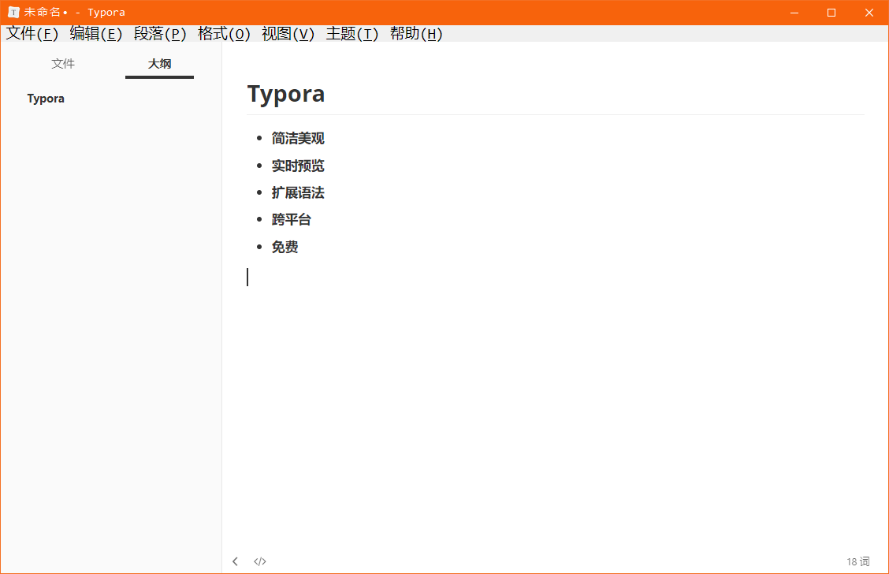
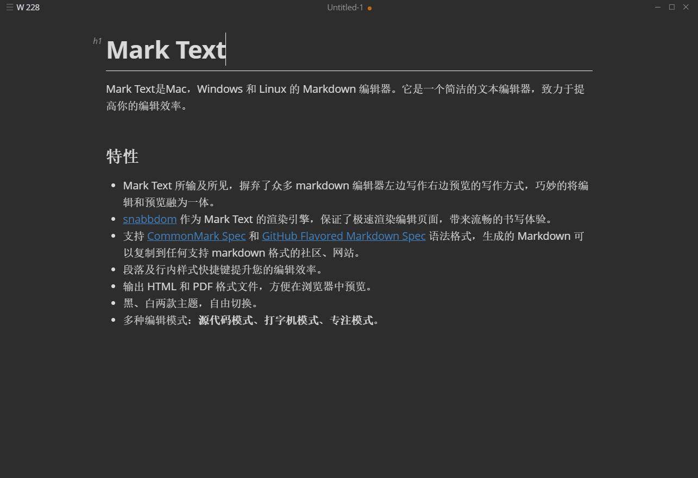
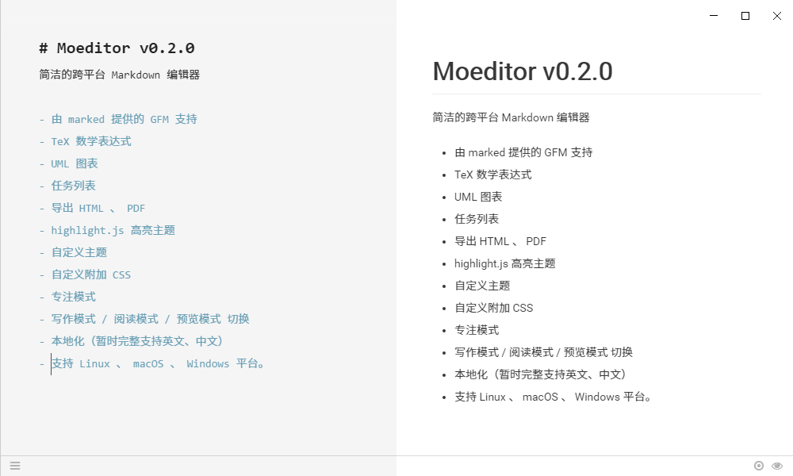
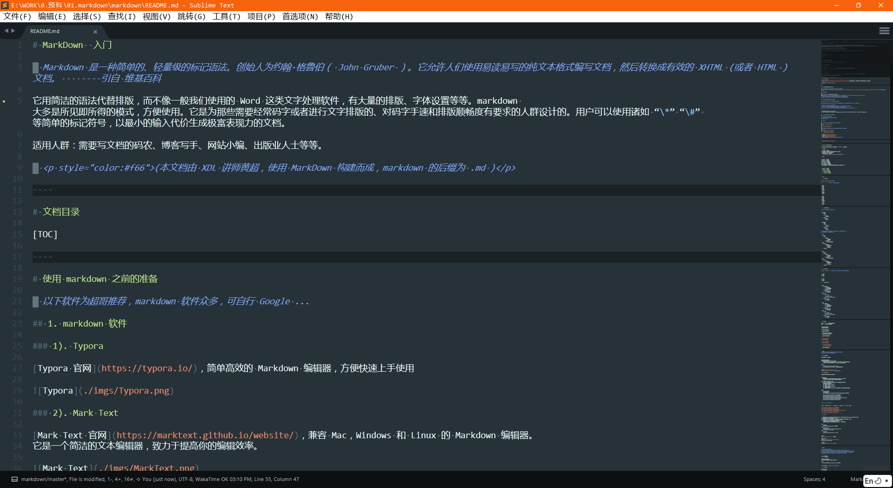
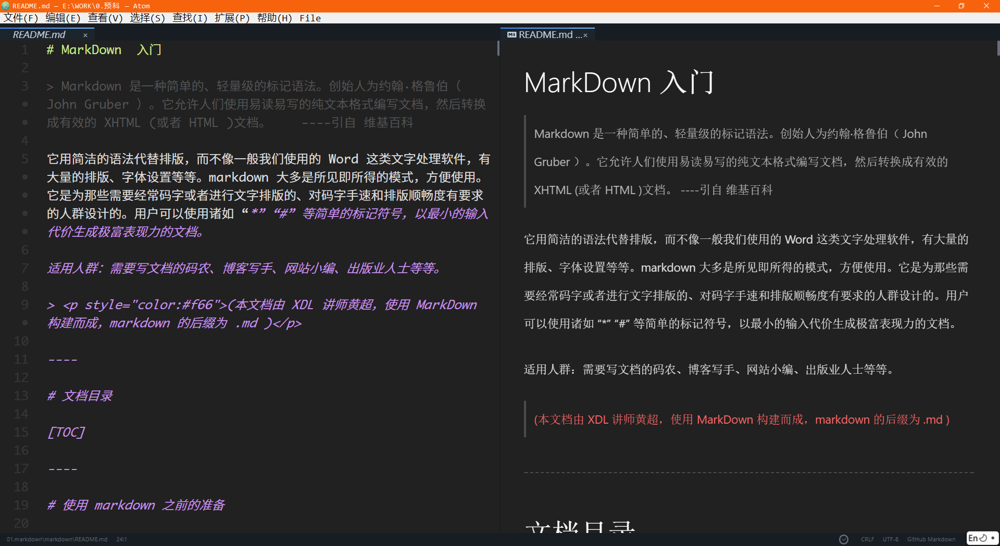
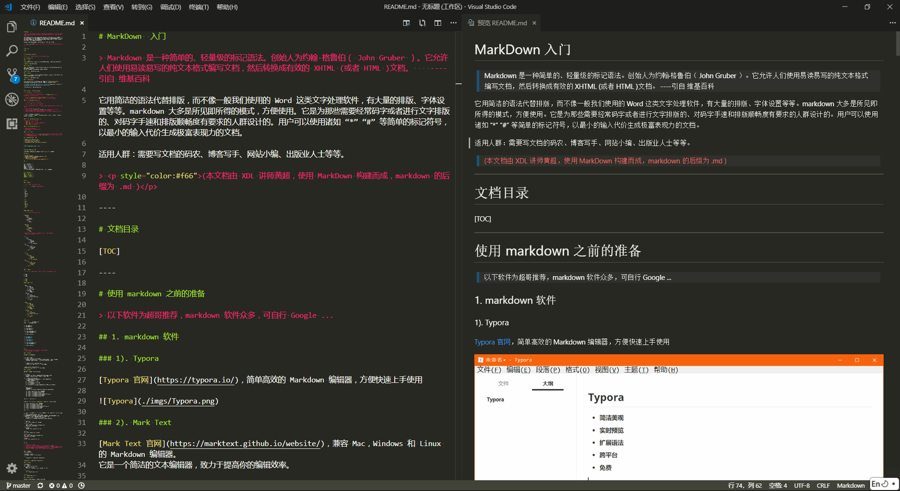

# MarkDown 入门

> [Markdown](https://zh.wikipedia.org/wiki/Markdown) 是一种简单的、轻量级的标记语法。创始人为约翰·格鲁伯（John Gruber）。
>
> 它允许人们使用，易读易写的纯文本格式编写文档，然后转换成有效的 HTML 文档。
>
> ——— 引用自《[维基百科](https://zh.wikipedia.org/wiki/)》

它用简洁的语法代替排版，而不像一般我们使用的 Word 这类文字处理软件，有大量的排版、字体设置等等。markdown 大多是所见即所得的模式，方便使用。

它是为那些需要经常码字或者进行文字排版的、对码字手速和排版顺畅度有要求的人群设计的。用户可以使用诸如 “\*” “\#” 等简单的标记符号，以最小的输入代价生成极富表现力的文档。

适用人群：需要写文档的码农、博客写手、网站小编、出版业人士等等。

> <p style="color:#f66">（本文档由 XDL 讲师黄超，使用 MarkDown 构建而成，markdown 的后缀为 .md）</p>

----

# 文档目录

[TOC]

----

# 使用 markdown 之前的准备

> 以下软件为超哥推荐，markdown 软件众多，可自行 Google ...

## 1. markdown 软件

### 1). Typora

[Typora 官网](https://typora.io/)，简单高效的 Markdown 编辑器，方便快速上手使用



### 2). Mark Text

[Mark Text 官网](https://marktext.github.io/website/)，兼容 Mac，Windows 和 Linux 的 Markdown 编辑器。
它是一个简洁的文本编辑器，致力于提高你的编辑效率。



### 3). Moeditor

[Moeditor 下载](https://github.com/Moeditor/Moeditor/releases)，特点是左右分栏，左边源码，右边即时显示效果，详见下图。



----

## 2. 代码编辑器 编写 Markdown

> 一些文本编辑器，也很好的提供了 markdown 的编写功能。
>
> 如  [Sublime 3](https://www.sublimetext.com/3)、 [Atom](https://atom.io)、 [Visual Studio Code](https://code.visualstudio.com) 等等，有兴趣可以自己 Google...

### Sublime 3



sublime 3 需要安装一些辅助插件，才能方便我们编写 markdown。由于这类插件众多，以下推荐两款，可根据个人喜好使用。

按`crtl+shift+p` 呼出 Package Control 工具列表

搜索并选择 `Package Control: Install Package` 安装插件功能。

> 首次使用 Package Control 需要安装控制插件: [Package Control](https://packagecontrol.io/installation) 
>
> 选择后，需要稍作等待，它要拉取在线的插件列表，如果拉取失败请重试！

#### 1). Markdown Preview 插件

功能 1: 按 `CTRL + B` 生成 HTML 网页文件 （默认功能)

> 该插件默认生成的 HTML 页面的 body 宽度是固定的。
>
> 如果想设置宽一些，建议将此值改大一些即可！

功能 2: 按 `ALT + M` 打开为网页 （需要自定义按键）

> 在 sublime 里选择 [首选项] -- [快捷键设置]，在打开的设置里添加 按键配置
>
> 按 alt+m，即可打开当前编辑的 markdown 文件为 HTML 网页
>
> 在 User 文件内，将以下代码添加至中括号内: (如有其他设置，需要在 {} 配置之前加 `,`)


```json
// 默认打开 markdown 为 html 文件
{ "keys": ["alt+m"], "command": "markdown_preview", "args": {"target": "browser", "parser":"markdown"} }
```

#### 2). MarkDown Editing 插件

> 支持 Markdown 语法高亮;
>
> 支持 Github Favored Markdown 语法;
>
> 自带 3 个主题.

### Atom

> GitHub 出品，自带预览模式的 Markdown 编辑器。



### Visual Studio Code

> 微软爸爸良心出品，全平台支持。自带预览模式的 Markdown 编辑器。



## 3. 在线的 MarkDown 编辑器

* [MaHua](http://mahua.jser.me/)
* [dillinger](http://dillinger.io/)
* [简书](http://www.jianshu.com/)
* [Cmd Markdown](https://www.zybuluo.com/mdeditor)

----

> *现在，准备工作做好了，我们开始吧！*

----

# MarkDown 的常用语法介绍

为了保证以下讲解的语法通用，所以都是基于**`源码模式`**来规定的。

## 基本规则

* 单个回车，视为空格.
* 连续回车，才能分段（即两段内容之间有一个空行）
* 行尾加两个空格，再加单个回车，即可段内换行
* 注释可使用 html 的注释：
  `<!--我是 html 的注释，在 markdown 内可以直接使用-->`

## 标题

```
源码: 
# 这是 H1 一级标题
## 这是 H2 二级标题
### 这是 H3 三级标题
#### 这是 H4 四级标题
##### 这是 H5 五级标题
###### 这是 H6 六级标题
（不同的编辑器，可能对标题的渲染样式有所不同，其原理一致。）

Typora 快捷键: 
一级标题: Ctrl + 1
二级标题: Ctrl + 2
...
以此类推

Ctrl + + 	加大标题
Ctrl + - 	减小标题
Ctrl + 0 	没有标题

```

# 这是 H1 一级标题
## 这是 H2 二级标题
### 这是 H3 三级标题
#### 这是 H4 四级标题
##### 这是 H5 五级标题
###### 这是 H6 六级标题

----

## 列表

### 1. 无序列表

> 注意，标记符号与文字之间有空格！
>
> **`*` `+` `-` 三种符号** 均可实现无序列表

```
* 中国
* 韩国
* 日本
+ 德国
+ 法国
+ 意大利
- 美国
- 加拿大
- 巴西
```

* 中国
* 韩国
* 日本
+ 德国
+ 法国
+ 意大利
- 美国
- 加拿大
- 巴西

----

##### 无序列表嵌套

> 注意，标记符号与文字之间有空格！
>
> 使用四个空格，来设置层级关系.

```
* 电子数码
    * 电脑
    * 手机
        * iphone
        * 锤子手机
    * 电器
        * 冰箱
        * 洗衣机
```

* 电子数码
    * 电脑
    * 手机
        * iphone
        * 锤子手机
    * 电器
        * 冰箱
        * 洗衣机

> 无序列表的标记符号可以混用，建议按层级书写，同级应该保持一致

```
* 中国
    + 北京
    + 上海
        - 静安区
            * XDL教育
            * 宝尊电商
        - 浦东新区
            * 东方明珠电视塔
* 美国
    + 纽约
        - 曼哈顿区
            * 自由女神像
            * 华尔街
            * 中央公园
    + 华盛顿
```

* 中国
    + 北京
    + 上海
        - 静安区
            * XDL教育
            * 宝尊电商
        - 浦东新区
            * 东方明珠电视塔
* 美国
    + 纽约
        - 曼哈顿区
            * 自由女神像
            * 华尔街
            * 中央公园
    + 华盛顿

----

### 2. 有序列表

> 使用 **`数字 + 点 + 空格`** 的形式来表示
>
> 标记符号与文字之间，依旧要有空格！

```
1. 文本
2. 音乐
3. 电影
```

1. 文本
2. 音乐
3. 电影

##### 有序列表嵌套

```
- 电影
    1. 美国电影
        1. 《蝙蝠侠》
        2. 《疯狂动物城》
        3. 《盗梦空间》
    2. 日本电影
        1. 《你的名字》
        2. 《小偷家族》
- 音乐
    1. 欧美
        1. 《fade》
        2. 《Lock Me Up》
        3. 《Dream It Possible》
    2. 国语
        1. 《生僻字》
        2. 《成都》
```

- 电影
    1. 美国电影
        1. 《蝙蝠侠》
        2. 《疯狂动物城》
        3. 《盗梦空间》
    2. 日本电影
        1. 《你的名字》
        2. 《小偷家族》
- 音乐
    1. 欧美
        1. 《fade》
        2. 《Lock Me Up》
        3. 《Dream It Possible》
    2. 国语
        1. 《生僻字》
        2. 《成都》

----

## 文字格式

使用 `*` 或 `_` 来设置斜体或加粗
使用 `~~` 来设置文本删除线

```
*这是文字斜体格式*
_这是文字斜体格式_

**这是文字粗体格式**
__这是文字粗体格式__

***这是文字粗体+斜体格式***
___这是文字粗体+斜体格式___

~~这是文字删除线格式~~

Typora:
加粗: Ctrl + B
倾斜: Ctrl + i
下划线: Ctrl + u
```

*这是文字斜体格式*  |  _这是文字斜体格式_

**这是文字粗体格式**  |  __这是文字粗体格式__

***这是文字粗体+斜体格式***  |  ___这是文字粗体+斜体格式___

~~这是文字删除线格式~~

----

## 链接
> 使用以下两种语法来设置链接文本，注意语法之间的空格
>
> 亦可使用`<a></a>`标签来设置链接

### 1. 直接设置 （推荐）

直接设置链接（行内形式）

```
格式: 
    [链接名称](链接地址)
    
    [链接名称](链接地址 "我是title描述")
        只要在方块括号后面，紧接着写小括号，并在小括号内，插入网址链接即可。
        小括号内，还可以选择性的加入 title 属性，用于描述该链接。

例如:
    [百度一下](http://www.baidu.com/)
    [ITXDL](http://www.itxdl.cn/ "兄弟连教育官网")
```

[百度一下](http://www.baidu.com/)  
[ITXDL](http://www.itxdl.cn/ "兄弟连教育官网")

### 2. 间接设置 （部分支持）

间接设置 链接可重复使用（参考形式）

```
[链接名称][1]
    参考式的链接，是在链接名称的括号后面，再接上另一个方括号
    而在第二个方括号里面，要填入用以辨识链接的标记。

[1]: 链接地址 "我是title描述"
    接着，在文件的任意处，你可以把这个标记的链接内容定义出来
    链接内容定义的形式为：
    1). 方括号，里面输入链接文字
    2). 接着一个冒号
    3). 接着一个以上的空格或制表符
    4). 接着链接的网址
    5). 选择性地接着 title 内容，它可以用单引号、双引号或是括号包裹着

例如:
    [B站][1]
    [Bilibili][1]
    [LAMP][2]是由[linux][3]/[apache][4]/[mysql][5]/[php][6]构成.

    [1]: https://www.bilibili.com/ "哔哩哔哩"
    [2]: https://zh.wikipedia.org/wiki/LAMP/
    [3]: https://zh.wikipedia.org/wiki/Linux/
    [4]: https://zh.wikipedia.org/wiki/Apache_HTTP_Server/
    [5]: https://zh.wikipedia.org/wiki/MySQL/
    [6]: https://zh.wikipedia.org/wiki/PHP/
```

[B站][1]  |  [Bilibili][1]


[LAMP][2] 是由 [linux][3] / [apache][4] / [mysql][5] / [php][6] 构成.

[1]: https://www.bilibili555.com/ "哔哩哔哩"
[2]: https://zh.wikipedia.org/wiki/LAMP/
[3]: https://zh.wikipedia.org/wiki/Linux/
[4]: https://zh.wikipedia.org/wiki/Apache_HTTP_Server/
[5]: https://zh.wikipedia.org/wiki/MySQL/
[6]: https://zh.wikipedia.org/wiki/PHP/

### 3. 其他 （部分支持）

```
1. 链接辨别标签，可以有字母/数字/空白/标点符号，但是并不区分大小写: [a] [A] 视为一致（例1）
2. 链接网址也可以用尖括号包起来。（例1）
3. 你也可以把 title 属性放到下一行，若网址太长的话，这样会比较好看。（例2）
4. 隐式链接标记功能，让你可以省略指定链接标记。（例3）
    这种情形下，链接标记会视为等同于链接文字，
    要用隐式链接标记，只要在链接文字后面，加上一个空的方括号.

例1:
    [花瓣][a]
    [A]: <http://huaban.com/> "花瓣网"
例2:
    [谷歌实验][gg]
    [gg]: https://experiments.withgoogle.com/
    "Experiments with Google"
例3:
    [ACFUN][]
    [ACFUN]: http://www.acfun.cn "A站"
```

[花瓣][a]

[A]: <http://huaban.com/> "花瓣网"

[谷歌实验][gg]

[gg]: https://experiments.withgoogle.com/
"Experiments with Google"

[ACFUN][]

[ACFUN]: http://www.acfun.cn "A站"

----

## 图片

> 图片的语法与链接很相似
>
> 注意: markdown 无法设置图片的宽高，如有需要，可自行添加``标签
>
> > 图片值得注意之处： 若是本地图片，那么 markdown 就会生成绝对地址，给你引入图片。
> >
> > 所以，想要正常的在 markdown 内展示自己添加的图片，还是选择一个网络的图床吧。
> >
> > 推荐使用 七牛云存储 或 微博图片 或 [SMMS](https://sm.ms) 等，或输出为 PDF 文件亦可。


### 1. 行内形式 （推荐）

title 为可选设置

```


例如:
    
```


### 2. 参考形式 （部分支持）

```
![替代文本][1]
[1]: 链接地址
[1]: 链接地址 "我是title描述"
    可设置 title 描述:
    需要注意: 链接地址的数字号，与普通的链接共享。

例如:
    ![喵][7]
    [7]: img/02.jpg "喵喵喵"
```

![喵][7]

[7]: ./img/02.jpg "喵喵喵"

### 3. 自定义图片宽高

markdown 默认的图片语法，不支持调整图片宽高。
需要使用 img 标签来搞定。

```
例如：
    下图过大
    
    
    换成
    
```


```
相对路径
	./ 		当前目录下, 默认
	../ 	上一级目录下
	../../ 	上上级目录下
	依次类推
	
	如果直接写文件名, 默认为 当前目录下  1.jpg   和 ./1.jpg 效果一样


绝对路径
	在线路径		http://www.baidu.com/xxx/xxx/a.jpg
	本地路径		D:/xxx/xxx/a.jpg
	
```


----

## 引用

```
> 设置引用文本
>> 设置嵌套的引用文本
```

> 我是引用的文本
>
> > 哎呀，好巧！ 我也是引用文本！（嵌套）


引用内可包含其他语法:

```
引用文本内，也可以使用其他的 Markdown 语法，包括标题、列表、代码区块等：
	
> + 网页三剑客
>     * html
>     * css
>     * javascript

> 欢迎来到全球最大的[程序员交友网站](https://github.com/)!
```

> + 网页三剑客
>     * html
>     * css
>     * javascript
>
> 欢迎来到全球最大的[程序员交友网站](https://github.com/)!

----

## 水平分隔线

> 可以在一行中用三个以上的星号、减号、下划线来建立一个分隔线，行内不能有其他东西。
>
> 也可以在星号或是减号或下划线中间插入空格。

```
---
___
***
- - - -
* * * *
```

---
___
***
## 代码块( 重点 )

### 1. 代码语句

> 如果要标记一小段的行内代码，你可以一对用反引号 \`\` 把它包裹起来

```
一句代码： `print(5201314)`
请问大神 `<frameset></frameset>` 是什么标签？
```

一句代码： `print(5201314)`
请问大神 `<frameset></frameset>` 是什么标签？

### 2. 代码段

> 以下两种方案皆可
>
> 代码段与其他元素之间，要有一个换行，前后都是如此。

##### 1). 空格代码段

使用4个空格，来定义代码段。一个代码区块会一直持续到，没有缩进的那一行或是文件结尾.
以下代码，需要查看 markdown 源码文件学习

    // 递归计算阶乘
    function fact(n) {
        if(n > 0){
            return n * fact(n-1);
        }
        if(n === 0){
            return n = 1;
        }
    }
    fact(5); // 120

##### 2). 使用反引号的代码段

使用三个以上反引号，定义代码段开始和结束。
以下代码，需要查看 markdown 源码文件学习。
代码的着色会根据 markdown 主题的不同，显示不同的样式。
代码段前置标记后，可标注次代码段的语言名字，用于代码高亮显示。

```php
// 一道面试题
$a = 3;
$b = 3;
if ($a = 5 || $b = 5) {
    $a++;
    $b++;
}
echo $a . '和' . $b; // 结果会输出什么？
```

```python
# AI核心代码，估值2个亿！
while True:
    strvar = input()
    strval = strval.repalce('?','!').repalce('?','!').repalce('吗','').replace('你','我')
    print(strval)
```

##### 3). 代码段内的特殊字符转义

在代码区块里面 `&` `<` `>` 会自动转成 HTML 实体。

```html
<div class="container">
    <div class="row">
        <h2>我是HTML代码块</h2>
    </div>
</div>
```

----

## 表格

```
|  表头1  |  表头2  |   表头3  |
|---------|---------|---------|
| 1-1 con | 1-2 con | 1-3 con |
| 2-1 con | 2-2 con | 2-3 con |
| 3-1 con | 3-2 con | 3-3 con |
```

```
快捷键: Ctrl + T
新增一行: Ctrl + Enter
```


| id   | name   | sex  | age  | cons |
| ---- | ------ | ---- | ---- | ---- |
| 1    | seeker | man  | 18   | 江苏 |
| 250  | jack   | man  | 40   | 米国 |
| 356  | Chris  | woman| 26   | 腐国 |
| 4125 | 三胖   | man  | 30   | 北朝 |
| 6666 | obama  | man  | 53   | 米国 |

----

## 列出 markdown 文档目录 （部分支持）

只需在你想要放入，目录结构的相应位置写入： `[TOC]` 即可！

----

## 自动转换

> `<` 与 `>` 符号用于 html 的起始标签， `&` 符号则用于标记 HTML 实体.

使用 markdown 语法设置链接时，要特别注意特殊字符会自动转换： `<` 、 `>` 、 `&`

如果你只是想要显示这些字符的原形，你必须要使用实体的形式: `&lt;` （小于号） 和 `&amp;` （大于号）等等

> Markdown 中的转义字符为 `\`（反斜线），转义的有:

```
\\   反斜杠
\`   反引号
\*   星号
\_   下划线
\{\} 大括号
\[\] 中括号
\(\) 小括号
\#   井号
\+   加号
\-   减号
\.   英文句号
\!   感叹号
```

# END

至此，markdown 的基本语法，已经介绍完了.

除了以上语法外，某些编辑器还做了语法扩展和补充，请自行了解学习。

> Thanks Bye Bye
>
> > XDL 讲师.黄超