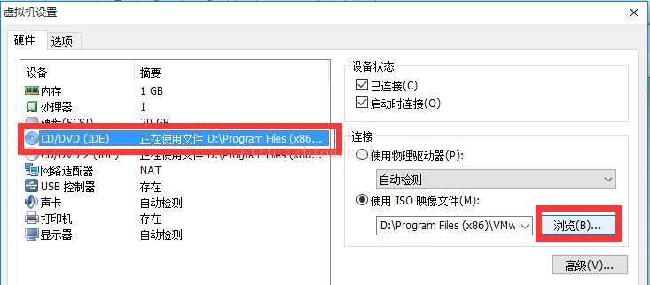

# 虚拟机VMware

由于很多新人对于windows安装不是很熟悉,  那Linux估计就更玄乎了. 

所以, 这里推荐大家使用 **虚拟机VMware** 来试手,  虚拟机VMware 可以在你本机电脑中 安装一个小系统, 这个小系统可以是 windows, 也可以是Linux,  只要通过虚拟机VMware 会安装系统了, 那么基本就能在实体电脑上安装系统了.

而且, 在**虚拟机VMware** 中的小系统中, 可以尝试任何软件, 就算有病毒也不会影响到本机电脑, 所有有很多人喜欢在虚拟机里面做各种实验, 大不了重装个虚拟机呗, 反正本机电脑也没啥损失.

# VMware下载

VMware官方地址:  https://www.vmware.com/cn.html

百度云盘地址:  https://pan.baidu.com/s/1B8D57lgYGK9JRoCCrGVyOw      提取码：emws 
				 
截至今日(2019.5.1), 最新版本 VMware 15,  这里就以这个版本来演示安装.

# VMware安装

1.  开始安装

2.   **勾选** "接受许可协议中的条款"

3.  安装路径

   个人不推荐安装在 **C 盘**,  可以选择 **D盘** 或 **E盘** 等等

4.  软件更新选择

   如果怕麻烦, 不想每次软件升级都更新的, 就不要勾选了

5.  快捷方式

6.  准备开始安装

7.  许可证, 激活软件

   许可证, 有条件的推荐你去官方购买.  要么去网络上查找可用的许可证.

# VMware安装Linux

在安装Linux之前, 需要先选择好Linux的哪一个发行版, 这里推荐使用 **CentOS 6.9**  

这是目前市场使用率最高的一个版本, 最新版已经达到了 **CentOS 7.6** 相对而言, 使用率还不高. 毕竟在IT行业, 不是最新的就代表最好, 且公司项目迁移比较费时费力.  

So, 学习CentOS 6.9 能直接符合市场需求. 后期有时间再了解了解新的版本

CentOS 6.9 下载地址: 	http://mirror.nsc.liu.se/centos-store/6.9/isos/x86_64/CentOS-6.9-x86_64-bin-DVD1.iso

其他版本地址:  http://mirror.nsc.liu.se/centos-store/

1.  打开虚拟机VMware

2. 安装类型, 选择 **自定义安装**

3. 选择 **硬件兼容性** , 尽可能选择高的

   **友情提醒:** 如果电脑配置比较低,  那么可以选择低的兼容, 例如 Workstation 10 , 甚至更低

 

4. 选择 **操作系统**

5.  CPU设置

6.  内存设置

   一般推荐点击 **绿色** 箭头, 使用推荐内存

7.  网络设置

   为了更好的学习,  这里推荐用 **桥接**,  平时个人使用, 推荐 **NAT**

8.  **I/O控制器**

9.  **磁盘**设置

​	

​						windows 系统: 最少40G

​						Linux 系统: 最少20G

10. 自定义硬件

11.  开始安装Linux

12. 界面说明

    - Install or upgrade an existing system 安装或升级现有的系统  **(推荐)**
    - install system with basic video driver 安装过程中采用基本的显卡驱动
    - Rescue installed system 进入系统修复模式
    - Boot from local drive   退出安装从硬盘启动
    - Memory test  内存检测

    **注意**:  部分电脑选择第一个, 会出现**屏幕显示异常**.  此时可重新选择**第二个**

13. 硬盘检测

    硬盘刚刚设置虚拟机时就添加好了, 所以没必要检测, 选择 **Skip** 跳过即可

14.  开始设置Linux 系统

磁盘一般都是我们在 windows 系统中称呼C盘, D盘用的.

在Linux 更多的都是称之为分区,   一个磁盘就是一个分区

**知识普及**

windows中,  C盘, D盘的磁盘系统类型:  主要有 FAT32,  NTFS 等.  其中 NTFS 使用较多

Linux中,  分区的文件系统类型:  主要有ext2, ext3, ext4, swap 等.  其中普通分区 ext4 使用较多

Linux 经常有以下几个分区:

| 分区  | 名称         | 描述                                                         | 大小                             |
| ----- | ------------ | ------------------------------------------------------------ | -------------------------------- |
| /boot | 系统启动分区 | 单独列出来, 是为了避免系统启动过慢                           | 200M 足矣                        |
| /     | 根分区       | 相当于windows的C盘                                           | 实验:  10G足矣 运维: 越大越好 |
| swap  | 内存交换分区 | Linux文件系统类型之一  当系统内存不足时, 可借用swap临时顶替, 度过**紧张期** 从而保证系统的稳定性 | 常规: 内存的2倍 最大: 2G      |
| /home | 家目录       | 常给普通用户使用, 平时软件可安装在此处                       | 剩余都给home                     |

登录成功之后的界面

当出现这一行时,  那么恭喜你, 已成功安装, 并进入了系统 ( 该系统界面是 **文本界面**, 而非**图形界面**). 后期可调整

​	

前几天重装系统，之后虚拟机需要重新装，装好后要使用vmware-tools实现文件共享，却发现虚拟机那里显示为灰色的，无法安装vmware-tools，在共享文件夹那里设置好共享的文件夹猴也没有用，/mnt目录下什么都没有。

​    

# 安装vmware-tool                                                                                                   

解决方法如下:

虽然重新安装vmware tools 显示是灰色的，但是虚拟机的下载包里面有linux.iso，这个就是我们需要的。

​                                                                         

我们需要安装在linux上面，步骤如下：
1. 挂载镜像文件，虚拟机->设置->硬件->CD/DVD.右边“连接”下面选择“使用IOS镜像文件”，浏览选择虚拟机包目录下面linux.iso

   

2. 挂载成功后，在虚拟机右下角cd/dvd,图标上单击选择“连接“。这样我装的CentOS7桌面就能看到光盘文件了

3. 打开光盘文件，文件夹中有名字为VMwareTools............tar.gz的压缩包，点击上面的解压缩按钮"extract",浏览选择需要解压到的目录，这里选择的的是home/documents目录,开始解压。

4. 打开终端界面，进入解压文件目录下，再输入sudo ./vmware-install.pl 回车，以后可能需要输入 yes,一直回车，重启虚拟机。

