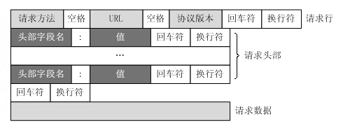

# HTTP协议

HTTP协议:超文本传送协议（Hypertext transfer Protocol）

### 换行、回车区别

符号        ASCII码        意义          英文

\n               10          换行			Line Feed

\r                13            回车CR	 Carriage Return

打印机中：

​		回车：这行结束，光标移到最左边

​		换行：打印机把纸向下移一行

​		回车+换行：这行结束，光标移到最左边，再向下移一行。

Windows中：

​		'\r' 回车，回到当前行首，不会换到下一行。

​		’\n‘换行，换到当前位置下一行，不会回到行首。

​		每行结尾是：'\r\n'--回车+换行

Unix系统中：

​		每行结尾是：'\n'--换行

Mac中：

​		每行结尾是：'\r'--回车

### http报文组成

1、起始行（对报文进行描述）

2、首部（包含属性）

3、主体（可选、包含数据）

起始行和首部之间用 ‘\r\n' 隔开

首部结束时一个'\r\n'和一个空行\n

# TCP协议

TCP/IP协议与HTTP协议（一）

https://www.cnblogs.com/laojiao/p/9653108.html

IP地址:全球唯一

MAC地址:烧录在硬件上的不能更改。是设备的唯一网络标识。

IP协议（Internet protocol）：找到对方的详细地址。

UDP(User Data Protocol,用户数据报协议)

FTP(File Transfer Protocol，文件传输协议)

DNS(Domain Name System,域名系统)，处于应用层提供域名（roverliang.com）到IP(192.168.1.11)地址之间的解析服务。

TCP协议(Transmission Control Protocol):属于传输层，提供可靠的字节流服务，把安全的东西带给对方。

字节流服务（Byte Stream Service，是指，为了方便传输，将大块数据分割成报文段（segment）为单位的数据包进行管理。

可靠的传输：能够吧数据准确可靠的传给对方。

##### 三次握手(three-way handshaking):

甲：在么，给你发个东西。

乙：在，你发吧。

甲：在就好，现在发给你，接一下。

