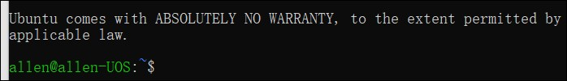

# 1、远程连接

## 1.linux查看ip

```
ip addr
```


## 2.windows远程连接

ssh username@ip地址

```
C:\Users\dell>ssh allen@192.168.137.128
ssh: connect to host 192.168.137.128 port 22: Connection refused
```

## 3.linux启动远程ssh管理服务

```c#
sudo service ssh start
```

Failed to start ssh.service: Unit ssh.service not found.

```
sudo apt install -y openssh-server
```

如果上一行代码保存，则执行下代码：

```
sudo apt update
```

## 4.返回windows继续执行步骤2

```
C:\Users\dell>ssh allen@192.168.137.128
```

后续可以执行linux命令



5.执行完毕。退出exit

### 2.拷贝文件

windows拷贝到远程linux

```
C:\Users\dell\Desktop>scp haha.txt allen@192.168.137.128:/home/allen/workspace
allen@192.168.137.128's password:
```


linux查看路径

```
allen@allen-UOS:~/workspace$ pwd
/home/allen/workspace
```

远程拷贝到windows

进入要拷贝的文件目录，鼠标右键，git bash here

dell@ZHANGPENGQI MINGW64 ~/Desktop/学习笔记

```
$ scp allen@192.168.137.128:/home/allen/workspace/README.md ./
```


# 2、linux基础--目录与文件操作


pwd  打印当前工作目录 print working directory

#### cd 切换目录 change directory

​	<font color=green>cd ~ 宿主目录 或直接cd</font>

​	<font color=green>cd - 上次的目录</font>

​	<font color=green>cd .. 上级目录（.代表当前目录）</font>


#### ls 列出目录中的文件 list

​	   <font color=red>ls -l  -a(选项)   /etc(参数)</font>选项可以写在一些ls  -la  /etc

​		<font color=green>ls  /etc  etc的list，其中/etc是路径</font>

​		<font color=green>ls -l 详细信息</font>

​		<font color=green>ls -a 显示所有文件（包含以点开头的文件）</font>

​		ls  -la

​		<font color=green>ls -F  在目录后加斜线显示</font>

​		<font color=green>ls -lh 人性话显示单位大小</font>


#### mkdir   创建目录 make directory

#### touch   创建一个空文件


#### rm 删除 remove

​	<font color=green>rm -r 删除目录</font>

​	<font color=green>rm -i 删除前提示（centOS默认）</font>

​	<font color=green>rm -f 删除文件不提示</font>

​	<font color=green>rm -rf 删除目录(不提示)</font>

​	<font color=green>rm -rf  ./*  删除当前目录所有文件</font>


#### mv 移动 move (重命名也是这个命令)

<font color=green>mv  移动的文件 目标文件夹</font>

```js
allen@allen-UOS:~/workspace/text/dte$ ls
textggg
allen@allen-UOS:~/workspace/text/dte$ cd ..
allen@allen-UOS:~/workspace/text$ ls
dte  textddd
```


#### 移动和改名一个命令

```js
allen@allen-UOS:~/workspace/text$ ls
dte  textaaa
allen@allen-UOS:~/workspace/text$ mv ./textaaa ./a
allen@allen-UOS:~/workspace/text$ ls
a  dte
```


#### cp 复制 copy

​	<font color=green>cp /etc/issue ./</font>  将issue文件复制至当前目录

​	<font color=green>cp -r 递归复制目录</font>


```js
allen@allen-UOS:~/workspace/text$ ls
a  dte  textggg
allen@allen-UOS:~/workspace/text$ cp ./a ./dte
allen@allen-UOS:~/workspace/text$ ls
a  dte  textggg
allen@allen-UOS:~/workspace/text$ cd dte
allen@allen-UOS:~/workspace/text/dte$ ls
a  textggg
```

```js
allen@allen-UOS:~/workspace/text$ cp -r ./dte ./dte2
allen@allen-UOS:~/workspace/text$ ls
a  dte  dte2  textggg
```

#### find 搜索

​	<font color=green>find  /etc  -name  init     	在/etc目录精确查找init文件</font>

​	<font color=green>find  /etc  -name  ‘init*’     	在/etc目录查找init文件</font>

<font color=green>	find  /etc  -name ’?init‘		在/etc目录查找init结尾文件，前面只有一个字符</font>

​	<font color=green>find  /usr/bin  -size +3M 	在 /usr/bin查找大于3M的文件</font>


#### which 显示命令路径

​	<font color=red>which phython3</font>

#### cat 显示文件内容

<font color=green>cat /etc/issue</font>

#### more

​	<font color=green>more  /etc/services   查看/etc/services文件</font>


<font color=green>	空格  翻页</font>

<font color=green>	回车  下一行</font>

<font color=green>	b 上一页</font>

<font color=green>	q   退出</font>

#### head 查看文件头几行

<font color=green>	head  -n  5 /etc/services</font>

#### tail  查看文件最后几行

<font color=green>	tail -n 5 /etc/services 		显示/etc/services文件最后5行</font>

<font color=green>	tail  -f  	减少文件变化</font>

#### ln 穿件连接

<font color=green>	ln  -s  源文件  新文件				创建软链接</font>

<font color=green>	ln 源文件  新文件   		创建硬链接</font>

#### echo 插入内容

<font color=green>	echo  ”加入的内容“  >>./a.text</font>

#### reset 重新初始化终端/清屏。

#### clear 清屏。

#### history 查看命令历史。

#### 解压

zip格式

<font color=green>	zip是window和linux都支持的格式。zip在linux下需要安装</font>

安装zip之前先跟新apt

输入命令

<font color=green>	update apt		更新软件源</font>

<font color=green>	apt install zip			安装zip</font>


<font color=green>	zip   -r  test.zip  test    打包，将text目录打包，生成text.zip文件</font>

<font color=green>	unzip  text.zip    解压</font>

tar.gz格式(z:格式，c:create，f:file，V:显示过程，一般省略不用)

<font color=green>	打包 tar -zcvf  text.tar.gz  text         (z:格式，c:create，f:file，V:显示过程，一般省略不用)</font>

<font color=green>	解压 tar  -zxvf  text.tar.gz			(z:格式，c:create，f:file，V:显示过程，一般省略不用)</font>

bz2格式

<font color=green>	打包 tar -cjf  text.bz2  text</font>

<font color=green>	解压 tar  -xjf  text.bz2</font>

查看文件的格式		

<font color=green>	file  文件名</font>

# 3、安装Linux的Windows子系统

[Windows10上使用Linux子系统(WSL)](https://www.cnblogs.com/xiaoliangge/p/9124089.html)

Linux的Windows子系统让开发人员可以直接在Windows上运行Linux环境（包括大多数命令行工具，实用程序和应用程序），而无需建立在虚拟机的开销之上，整个系统共200多M，但包含了你能用到的所有功能，并且和windows完美互操作(**省去linux挂载本地windows分区或目录的操作**)，目前Linux的windows子系统已经相当完善，可当作完整linux系统使用

您可以：

1. [从Windows应用商店中](https://aka.ms/wslstore)选择您最喜爱的Linux发行版。
2. 运行常用的命令行实用程序，如`grep`，`sed`，`awk`等。
3. 运行Bash shell脚本和Linux命令行应用程序，包括：
   - 工具：vim，emacs，tmux
   - 语言：Javascript / node.js，Ruby，Python，C / C ++，C＃和F＃，Rust，Go等
   - 服务：sshd，MySQL，Apache，lighttpd
4. 使用发行版的内置包管理器（`apt-get`）安装其他Linux工具。
5. 从Linux控制台调用Windows应用程序。
6. 在Windows上调用Linux应用程序。

##  1、在小娜窗口搜索“功能”


 

或者直接PowerShell中运行以下命令

Enable-WindowsOptionalFeature -Online -FeatureName Microsoft-Windows-Subsystem-Linux

出现提示重新启动计算机

## 2、安装Linux

在应用商店搜索“Linux”,选择您喜欢的Linux版本，推荐安装Ubuntu


注意：应用商店的程序使用默认路径，不要更换到其他盘符


安装完毕后出现

现在可以在里面进行任何和linux相关的命令


## cd mnt  进入了windows系统的文件系统

cd到根目录执行 cd mnt进入linux系统


用linux命令对windows文件进行操作

## cmd.exe或者power shell中执行linux命令

在power shell中执行bash.exe,进入linux环境下

 

以上路径显示：在windows中的c文件夹下(C盘符)

 windows与linux交互演示

# 更换阿里源出现的问题

[win10内置Ubuntu/Linux换阿里源(小白教程)](https://blog.csdn.net/qq_43914736/article/details/92799581?depth_1-utm_source=distribute.pc_relevant.none-task-blog-BlogCommendFromBaidu-7&utm_source=distribute.pc_relevant.none-task-blog-BlogCommendFromBaidu-7)

检查vim是否支持 **+clipboard**，检查的方法

```bash
vim --version | grep clipboard
```


[[vim复制到剪切板](https://www.cnblogs.com/callmelord/p/11579646.html)]

如果找到的是负号开头的**`-clipboard`，**说明你的vim不支持系统剪切板，我的MacOS系统自带vim就不支持，所以跑来了。需要先重新安装vim，

Linux系统，

```text
sudo apt install vim-gtk
```

MacOS

```text
brew install vim
```

安装好之后，重复情况一的操作即可。

修改源文件

```bash
vi /etc/apt/source.list
```


阿里云源

```
deb http://mirrors.aliyun.com/ubuntu/ bionic main restricted universe multiverse
deb-src http://mirrors.aliyun.com/ubuntu/ bionic main restricted universe multiverse

deb http://mirrors.aliyun.com/ubuntu/ bionic-security main restricted universe multiverse
deb-src http://mirrors.aliyun.com/ubuntu/ bionic-security main restricted universe multiverse

deb http://mirrors.aliyun.com/ubuntu/ bionic-updates main restricted universe multiverse
deb-src http://mirrors.aliyun.com/ubuntu/ bionic-updates main restricted universe multiverse

deb http://mirrors.aliyun.com/ubuntu/ bionic-proposed main restricted universe multiverse
deb-src http://mirrors.aliyun.com/ubuntu/ bionic-proposed main restricted universe multiverse

deb http://mirrors.aliyun.com/ubuntu/ bionic-backports main restricted universe multiverse
deb-src http://mirrors.aliyun.com/ubuntu/ bionic-backports main restricted universe multiverse
```


完成，切记要再用sudo apt-get update 更新一下，即可。 

```bash
sudo apt-get update
```

```bash
sudo apt install nodejs
```

