[toc]


# 1、SpringBoot创建项目

## 方式1：网站,start.spring.io

主流框架spring boot 有官方网
start.spring.io/start.aliyun.con

### 1、创建demo


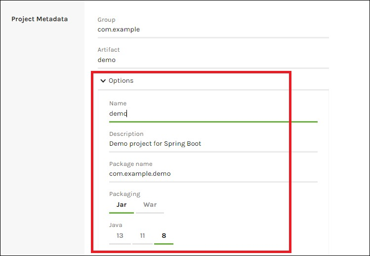

### 2、配置依赖


依赖：

+ Spring Web
+ MySQL Driver//mySQL驱动
+ MyBatis Framework//框架，简化mySQL操作。
+ Lombok//插件
+ Spring Boot DevTools//开发工具包
+ Thymeleaf//模板引擎

创建后，下载。

解压压缩包，在idea中打开。

### 3、配置阿里云源

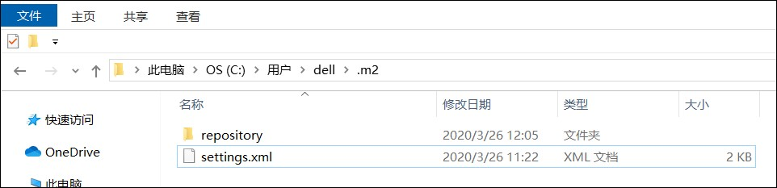

#### settings.xml内容

```xml
<?xml version="1.0" encoding="UTF-8"?>

-<settings xsi:schemaLocation="http://maven.apache.org/SETTINGS/1.0.0 http://maven.apache.org/xsd/settings-1.0.0.xsd" xmlns:xsi="http://www.w3.org/2001/XMLSchema-instance" xmlns="http://maven.apache.org/SETTINGS/1.0.0">

<pluginGroups> </pluginGroups>

<proxies> </proxies>

<servers> </servers>


-<mirrors>

<!-- 阿里云仓库 -->


-<mirror>

<id>alimaven</id>

<mirrorOf>central</mirrorOf>

<name>aliyun maven</name>

<url>http://maven.aliyun.com/nexus/content/repositories/central/</url>

</mirror>

<!-- 中央仓库1 -->


-<mirror>

<id>repo1</id>

<mirrorOf>central</mirrorOf>

<name>Human Readable Name for this Mirror.</name>

<url>http://repo1.maven.org/maven2/</url>

</mirror>

<!-- 中央仓库2 -->


-<mirror>

<id>repo2</id>

<mirrorOf>central</mirrorOf>

<name>Human Readable Name for this Mirror.</name>

<url>http://repo2.maven.org/maven2/</url>

</mirror>

</mirrors>

<profiles> </profiles>

</settings>
```


### 4、查看版本号


### 5、修改配置文件

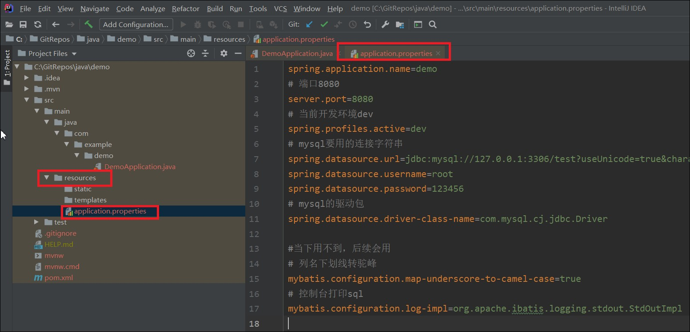

```properties
spring.application.name=demo
# 端口8080
server.port=8080
# 当前开发环境dev
spring.profiles.active=dev
# mysql要用的连接字符串
spring.datasource.url=jdbc:mysql://127.0.0.1:3306/test?useUnicode=true&characterEncoding=utf8&useSSL=false&zeroDateTimeBehavior=convertToNull&serverTimezone=Asia/Shanghai
spring.datasource.username=root
spring.datasource.password=123456
# mysql的驱动包
spring.datasource.driver-class-name=com.mysql.cj.jdbc.Driver

#当下用不到，后续会用
# 列名下划线转驼峰
mybatis.configuration.map-underscore-to-camel-case=true
# 控制台打印sql
mybatis.configuration.log-impl=org.apache.ibatis.logging.stdout.StdOutImpl
#数据库data类型转换
spring.jackson.date-format=yyyy-MM-dd HH:mm:ss
spring.jackson.time-zone=GMT+8
```

+ 

### 6、创建文件:HelloController

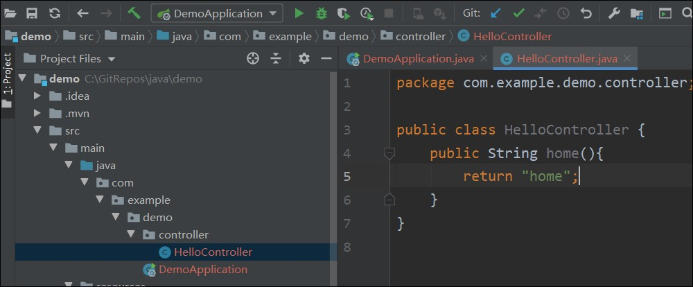

###  7、创建home.html

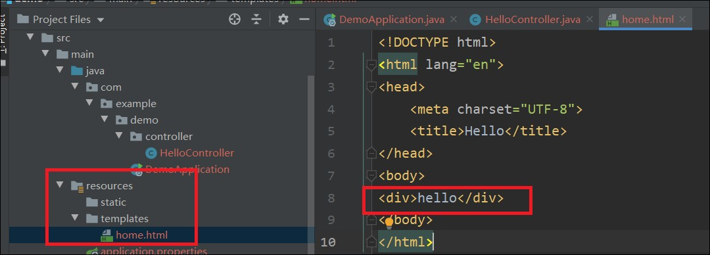

### 8. 补充修改：HelloController

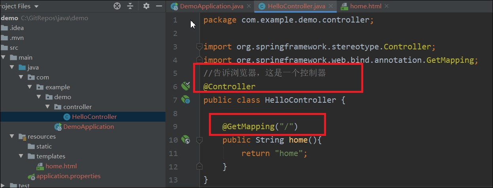

运行DemoApplication。访问localhost:8080,显示hello，成功

## 方式2：idea

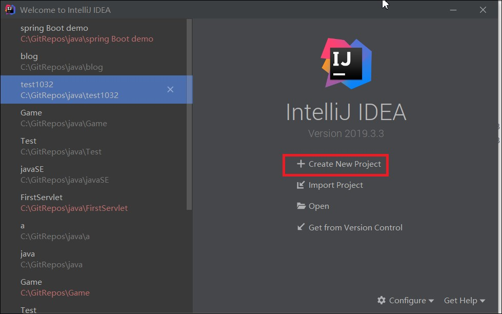


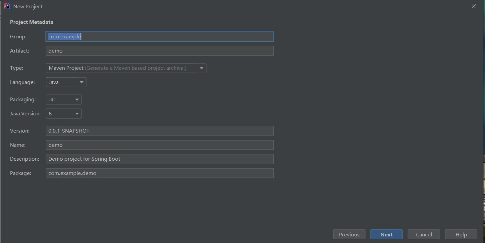

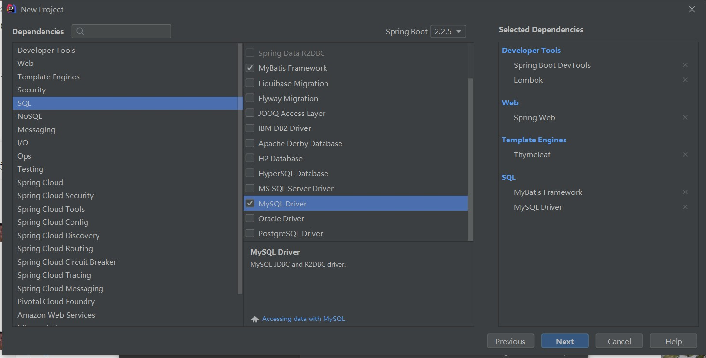

# 2、mvc

m  -model，

v -view,视图，resources下的HTML文件

c  -controller，控制器

## 1、v，c的应用

controller文件中return的是home，显示的就是home.html文件内容

controller文件中return的是detail，显示的就是detail.html文件内容

templates，意思：**模板**

```java
public class HelloController {

    @GetMapping("/")
    public String home(){
        return "home";
    }
}
```

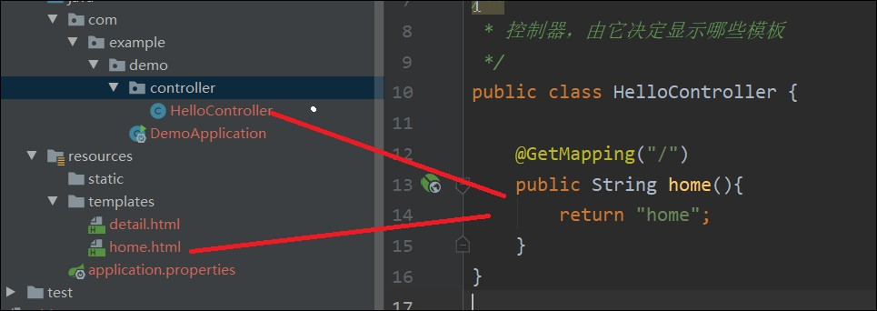

## 2、model的应用

1、引入model

2、向model中添加元素

3、在对应的html文件中编写、添加标记<font color=red>       默认标记是错的，需要更改</font>

```
xmlns:th="http://www.thymeleaf.org"
```

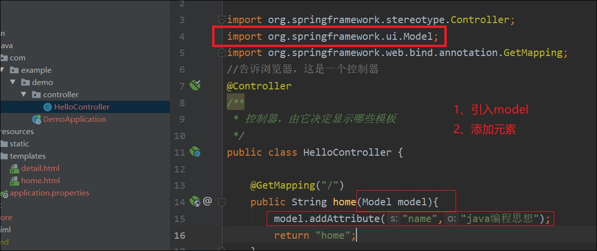

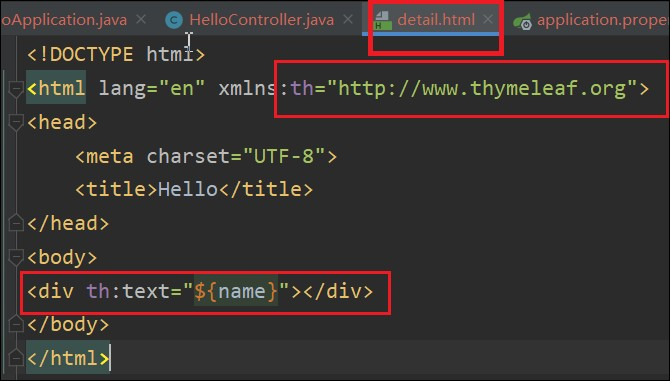

# 3、创建基本数据类，页面跳转 

创建entity包   [ˈentəti]，实体

demo文件下建一个entity包。entity存放实体类

创建book类

```java
package com.example.demo.entity;
import lombok.Data;
import java.math.BigDecimal;

@Data
public class Book {
    private int id;
    private String name;
    private int categoryId;
    private BigDecimal price;
    private String isbn;
}
```

## 3、控制器中创建集合，添加数据，加入model

```java
List<Book> bookList=new ArrayList();
bookList.add(new Book(7,"物理",1,3,"4","sdf"));
bookList.add(new Book(8,"物理",1,3,"4","sdf"));
model.addAttribute("bookList",bookList);
```

#### <font color=red>### 此处IDEA报错。提示创建构造函数</font>

解决方案：运行报错。然后装个lombok插件。

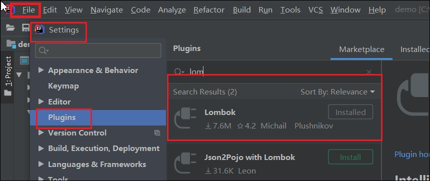


## 4、html中循环数据

```html
<ul>
    <li th:each="book: ${bookList}">
        <a href="" th:text="${book.name}"></a>
    </li>
</ul>
```

第一行{ }中名字和控制器中名字一样

## 5、跳转

```java
 <a th:href="@{ 'detail?id=' + ${book.id} }" th:text="${book.name}"></a>
```

跳转格式：

```java
th:href="@{ 'detail?id=' + ${book.id} }"
```

跳转后的页面在控制器中写代码

```java
    @GetMapping("/detail")
    public String detail(Model model, HttpServletRequest request){
        int id= Integer.parseInt(request.getParameter("id"));
        Book book=new Book(id,"hahaha",1,1,"3","dsf");
        model.addAttribute("book",book);
        return "detail";
    }
```

然后再templates中写对应的html页面

# 4、操作数据库

## 1、创建数据库，插入数据

```mysql
CREATE TABLE `book`(
  `id` int (11) NOT NULL AUTO_INCREMENT,
  `name` varchar(50) NOT NULL DEFAULT '' COMMENT '书名',
  `category_id` int(3),
  `quantity` int(5),
  `price` decimal(5,2) COMMENT '价格',
  `isbn` varchar(20) ,
  PRIMARY KEY (`id`)
)ENGINE=InnoDB DEFAULT CHARSET=utf8mb4;
```

 

```mysql
insert into book (name,category_id,quantity,price,isbn) values
(
'java',1,10,100,12345),
('c',2,10,10,2345),
('js',3,10,10,345),
('数学',4,10,100,12345),
('语文',5,10,10,2345),
('英语',6,10,10,345);

```

## 2、创建mapper  意思：**映射**

创建包mapper,用于数据库和entity的映射

### 1、创建接口BookMapper

```java
package com.example.demo.entity.mapper;
import com.example.demo.entity.Book;
import org.apache.ibatis.annotations.Select;
import java.util.List;

public interface BookMapper {
    @Select("SELECT * FROM book")
    List<Book> findBooks();
}
```

### 2、去控制器依赖注入

```java
@Autowired//自动注入
BookMapper bookMapper;
```

下面就可以直接使用

```java
List<Book> bookList=bookMapper.findBooks();
```

### 3、添加@MapperScan

在DemoApplication中添加@MapperScan("com.example.demo.mapper")

```java
@SpringBootApplication
@MapperScan("com.example.demo.mapper")
public class DemoApplication {

   public static void main(String[] args) {
      SpringApplication.run(DemoApplication.class, args);
   }

}
```

详情页面的查询

Mapper中添加一条接口

```java
@Select("SELECT * FROM book WHERE id=#{id}")
Book findBookById(@Param("id") int id);
```


控制器中添加语句

```java
int id= Integer.parseInt(request.getParameter("id"));
Book book=bookMapper.findBookById(id);
model.addAttribute("book",book);
```

# 5、post基础用法（5~9一节课，post配合springboot使用）

## 1、post请求

<font color=red>RESTful风格通常url用复数形式</font>

### 1.1 x-www-form-rulencoded

form表单传递格式：x-www-form-rulencoded

对应


成功返回的数据如下:

```js
{
	"code": "SUCCESS",
	"message": null,
	"data": {
        "id": 1,
        "name": "书名1",
        "describe": "图书描述",
        "createdAt": "2020-02-17 14:39:07"
	}
}
```


控制器中代码

```java
/**
 * 插入图书
 * @param name 图书名称
 * @param describe 图书详情
 * @return
 */
@PostMapping("/books")
public JsonResult<Book> createBook(String name,String describe){
    Book book=Book.builder()
            .name(name)
            .describe(describe)
            .createdAt(new Timestamp(new Date().getTime()))
            .build();
    bookMapper.insertBookByNameAndDescribe(book);
    System.out.println(book.getCreatedAt());
    return  new JsonResult<Book>(book);
}
```

mapper中代码

```java
/**
 * 插入图书
 * @param book 图书信息
 */
@Insert("INSERT INTO book (name,`describe`) values (#{name},#{describe})")
@Options(useGeneratedKeys = true,keyProperty = "id")
void insertBookByNameAndDescribe(Book book);
```

useGeneratedKeys原理

Mybatis 配置文件 useGeneratedKeys 参数只针对 insert 语句生效，默认为 false。当设置为 true 时，表示如果插入的表以自增列为主键，则允许 JDBC 支持自动生成主键，并可将自动生成的主键返回。


### 1.2 json格式

<font color=red>不能用form表单传递，实际开发中用的非常非常多</font>


对应post请求


控制器代码

<font color=red>1、<b>@PathVariable</b> ：url后面直接跟参数的，例如：/books/{bookId}</font>

<font color=red>		控制器代码中需增加 </font>

<font color=red>2、<b>@RequestBody</b>：Json格式接收参数，控制器中代码需加</font>

```java
/**
 * 更新图书
 * @param bookId 图书id
 * @param booksRequest 跟新内容
 * @return
 */
@PostMapping("/books/{bookId}")
public JsonResult  updateBooks(@PathVariable int bookId, @RequestBody BookRequest booksRequest){
    System.out.println(bookId);
    System.out.println(booksRequest);
    System.out.println("bookController");
    int isUpdate=bookMapper.updateBooks(bookId,booksRequest);

    if(isUpdate==1){
        return new JsonResult("SUCCESS","更新成功");
    }
    if(isUpdate==0){
        return new JsonResult("ERROR","id不存在");
    }
    return null;
}
```

BookRequest代码

```java
@Data
@NoArgsConstructor
@AllArgsConstructor
@Builder
public class BookRequest {
    private String name;
    private String describe;
}
```

mapper中的代码

```java
/**
 * 更新图书
 * @param bookId 跟新图书的id
 * @param bookRequest 跟新图书的具体信息
 * @return 更新图书的条数，没有更新返回0
 */
@Update("UPDATE book SET name=#{bookRequest.name},`describe`=#{bookRequest.describe} WHERE id=#{bookId}")
int updateBooks(int bookId, @Param("bookRequest")BookRequest bookRequest);
```


###### <font color=red>@Param注解</font>

官方解释

```tex
@Param Parameter N/A 如果你的映射器的方法需要多个参数, 这个注解可以被应用于映射器的方法 参数来给每个参数一个名字。否则,多 参数将会以它们的顺序位置来被命名 (不包括任何 RowBounds 参数) 比如。 #{param1} , #{param2} 等 , 这 是 默 认 的 。 使 用 @Param(“person”),参数应该被命名为 #{person}。
```

————————————————

传递多个不是javabean时，才使用@Param，一下三种不使用：

<font color=red>1、传递单个参数，不需要使用@Param</font>

```java
@Select("SELECT * FROM token WHERE token=#{token}")
Token selectByToken(String token);
```

<font color=red>2、传递多个参数，并且是Javabean时，</font>

```java
@Insert("INSERT INTO token (id,token) values (#{id},#{token}) ")
void insertToken( Token token);
```

<font color=red>3、传递单个参数，且是javabean中的一部分。</font>

```javascript
// 这里id是user的属性
@Select("SELECT * from Table where id = ${id}")
    Enchashment selectUserById(User user);
```

<font color=red>4、使用@Param的时候</font>

```java
@Select("<script>"+
    "SELECT * FROM book"+
    "<where>"+
    "<if test='book.name!=null'> AND name LIKE CONCAT('%',#{book.name},'%')</if>"+
    "</where>"+
    "ORDER BY id DESC"+
    " LIMIT #{pagination.offset},#{pagination.limit}"+
    "</script>"
)
List<Book> selectBooks(@Param("book") Book book, @Param("pagination") Pagination pagination);
```


<font color=red>###注意点###</font>

1、update中set后的多对信息，用逗号(,)隔开，不是and

## 2、get请求

请求参数(QueryParams)：
		例如 /books?name=java&page=2&limit=5


成功返回的数据如下

```js
{
	"code": "SUCCESS",
	"message": null,
	"data": {
		"pagination": { //⻚码信息
			"total": 2, //共有多少条数据
			"page": 1, //当前是第⼏⻚
			"limit": 5, //每⻚多少条数据
		},
		"books": [ //图书数据
			{
				"id": 1,
				"name": "书名1",
				"createdAt": "2020-02-17 14:39:07"
			},
			{
				"id": 2,
				"name": "书名2",
				"createdAt": "2020-02-17 14:39:07"
			}
		]
	}
}
```


控制器中代码

```java
/**
 *  查找图书列表
 * @param name 图书名字
 * @param pagination 分页信息
 * @return
 */
@GetMapping("/books")
public JsonResult Books(String name,Pagination pagination){
    //获取符合条件的总记录数，用于分页
    Book book=Book.builder().name(name).build();
    pagination.setTotal(bookMapper.count(book));

    //分页查询数据
    List<Book> books=bookMapper.selectBooks(book,pagination);

    Map<String,Object> data=new HashMap<String,Object>();
    data.put("pagination",pagination);
    data.put("books",books);
    return new JsonResult(data);
}
```

mapper中代码

```java
/**
 * 给定条件图书的数量
 * @param book 查询图书的条件
 * @return 符合条件的图书数量
 */
@Select("<script>"+
        "SELECT COUNT(*) FROM book"+
        "<where>"+
        "<if test='book.name!=null'> AND name LIKE CONCAT('%',#{book.name},'%')</if>"+
        "<if test='book.id!=0'> AND id=#{book.id}</if>" +
        "</where>"+
        "</script>")
int count(@Param("book") Book book);
```

```java
/**
 *  查询图书列表
 * @param book 查询图书的信息
 * @param pagination 分页信息
 * @return 图书列表
 */
@Select("<script>"+
        "SELECT * FROM book"+
        "<where>"+
        "<if test='book.name!=null'> AND name LIKE CONCAT('%',#{book.name},'%')</if>"+
        "</where>"+
        "ORDER BY id DESC"+
        " LIMIT #{pagination.offset},#{pagination.limit}"+
        "</script>"
)
List<Book> selectBooks(@Param("book") Book book, @Param("pagination") Pagination pagination);
```

# 6、post和idea配合，响应数据


#### <font color=red>控制器叫什么名字（demo），url前面字段就叫啥，方法叫什么名字（hi），url后面字段就叫啥</font>


### 2.1 响应单个数据


```java
@GetMapping("/demo/getBook")
public Book getBook(){
    Book book=new Book();
    book.setId(1);
    book.setName("java编程思想");
    book.setPrice(new BigDecimal(25.00));
    book.setDescribe("hello,你好");
    return book;
}
```


浏览器也可以访问结果如下

http://localhost:8080/demo/getBook

```js
{"id":1,"name":"java编程思想","price":25,"describe":"hello,你好","status":null,"createdTime":null}
```


### 2.2 Builder()

```java
@Data//get ,set,toString,hashCode,equals
@Builder//可以随意赋值，不是全参的时候，不用一个一个去set
@NoArgsConstructor//无参构造
@AllArgsConstructor//全参构造
public class Book {
    private int id;//图书id
    private String name;//图书名称
    private BigDecimal price;//图书单价
    private String describe;//图书描述
    private String status;//状态
    private Timestamp createdTime;//创建时间
}
```

```java
    @GetMapping("/demo/getBook")
    public Book getBook(){
        Book book=Book.builder().id(1).name("java编程思想").price(new BigDecimal(23)).build();
        return book;
    }
```

### 2.3 响应集合

```java
    @GetMapping("/demo/getBooks")
    public List<Book> getBooks(){
        List<Book> bookList=new ArrayList<>();
        bookList.add(Book.builder().id(1).name("java编程思想").price(new BigDecimal(23)).build());
        bookList.add(Book.builder().id(2).name("c语言入门教程").price(new BigDecimal(25)).build());
        return bookList;
    }
```

postman返回数据

```js
[
    {
        "id": 1,
        "name": "java编程思想",
        "price": 23,
        "describe": null,
        "status": null,
        "createdTime": null
    },
    {
        "id": 2,
        "name": "c语言入门教程",
        "price": 25,
        "describe": null,
        "status": null,
        "createdTime": null
    }
]
```


### 2.4 响应状态码错误消息

建一个util包，下面一个Result类

```java
package com.example.task1044.util;
import lombok.AllArgsConstructor;
import lombok.Getter;

@Getter
@AllArgsConstructor
public class Result {
    private String code;
    private String message;
    private String data;
}
```

控制器中建Result

```java
@GetMapping("/demo/getResult")
public Result getResult(){
    Result result= new Result("SUCCESS","请求数据成功","啦啦啦");
    return result;
}
```

postman 返回数据

```javascript
{
    "code": "SUCCESS",
    "message": "请求数据成功",
    "data": "hahaha"
}
```


### 2.5 Data改为泛型

#### 1、一个对象

```java
@Getter
@AllArgsConstructor
public class Result<T> {
    private String code;
    private String message;
    private T data;
}
```


```java
    @GetMapping("/demo/getResult")
    public Result<Book> getResult(){

        Book book=Book.builder().id(1).name("java编程思想").price(new BigDecimal(23)).build();
        Result result= new Result<Book>("SUCCESS","请求数据成功",book);
        return result;
    }
```

postman返回数据

```js
{
    "code": "SUCCESS",
    "message": "请求数据成功",
    "data": {
        "id": 1,
        "name": "java编程思想",
        "price": 23,
        "describe": null,
        "status": null,
        "createdTime": null
    }
}
```


#### 2、一个集合

```java
@Getter
@AllArgsConstructor
public class Result<T> {
    private String code;
    private String message;
    private T data;
}
```


```java
@GetMapping("/demo/getResult2")
public Result<List<Book>> getResult2(){
    List<Book> bookList=new ArrayList<>();
    bookList.add(Book.builder().id(1).name("java编程思想").price(new BigDecimal(23)).build());
    bookList.add(Book.builder().id(2).name("c语言入门教程").price(new BigDecimal(25)).build());
    Result result= new Result<List<Book>>("SUCCESS","请求数据成功",bookList);
    return result;
}
```

postman返回数据

```js
{
    "code": "SUCCESS",
    "message": "请求数据成功",
    "data": [
        {
            "id": 1,
            "name": "java编程思想",
            "price": 23,
            "describe": null,
            "status": null,
            "createdTime": null
        },
        {
            "id": 2,
            "name": "c语言入门教程",
            "price": 25,
            "describe": null,
            "status": null,
            "createdTime": null
        }
    ]
}
```

# 7、接收参数

<font color=red> 接收参数，既可以是Json，也可以是x-www-form-urlencoded</font>

<font color=red>同一个项目中，尽量用同一种接收方式，前端方便</font>

## 3.1 get请求

### 3.1.1 普通参数(HttpServletRequest接收)


java控制器中代码：

```java
@RestController
public class DemoController {
    @GetMapping("/demo/params")
    public String params(HttpServletRequest request){
        System.out.println("id："+request.getParameter("id"));
        System.out.println("name:"+request.getParameter("name"));
        return "hi";
    }
}
```

postman请求

http://localhost:8080/demo/params?id=1&name=jack

控制台打印输出

```
id：1
name:jack
```

### 3.1.2 简单的方法（直接用String name，int id接收）

```java
@RestController
public class DemoController {
    @GetMapping("/demo/params")
   public String params(int id,String name){
        System.out.println("id："+id);
        System.out.println("name:"+name);
        return "hi";
    }
}
```

postman请求

http://localhost:8080/demo/params?id=2&name=marry

控制台打印输出

```
id：2
name:marry
```

### 3.1.3 dto参数，

Data Transfer Object，数据传输对象

#### 3.1.3.1新建包dto，新建类DemoRequest.java

```java
package com.example.task1044.dto;

import lombok.AllArgsConstructor;
import lombok.Builder;
import lombok.Data;
import lombok.NoArgsConstructor;

@Data
@NoArgsConstructor
@AllArgsConstructor
@Builder
public class DemoRequest {
    private String name;
    private int age;
    private int limit;
}
```

#### 3.1.3.2 控制器编码

```java
@GetMapping("/demo/params")
public String params(DemoRequest demoRequest){
    System.out.println(demoRequest);
    return "hi";
}
```

#### 3.1.3.3 postman的get请求

http://localhost:8080/demo/params?id=2&name=marry&limit=3

#### 3.1.3.4 控制台打印输出

```
DemoRequest(name=marry, age=0, limit=3)
```

### 3.1.3.4 三种方法可以混合使用

#### 3.4.1 控制器代码

```java
@GetMapping("/demo/params")
public String params(DemoRequest demoRequest,String name,HttpServletRequest request){
    System.out.println(demoRequest);
    System.out.println(name);
    System.out.println(request.getParameter("content"));
    return "hi";
}
```

#### 3.4.2 postman请求

http://localhost:8080/demo/params?id=2&name=marry&limit=3&content=hello

#### 3.4.3 控制台打印输出

```
DemoRequest(name=marry, age=0, limit=3)
marry
hello
```

## 3.2 post请求

### 3.2.1 x-www-form-urlencoded格式DemoRequest

控制器代码

```java
@PostMapping("/demo/paramsPost")
public String paramsPost(DemoRequest demoRequest){
    System.out.println(demoRequest);
    return "hi";
}
```

postman 请求


控制台输出

```
DemoRequest(name=毛选, age=15, limit=3)
```

### 3.2.2 格式 JSON@RequestBody

控制器代码

加注解：<font color=red>@RequestBody参数</font>

@RequestBody能把简单json结构参数转换成实体类，如下代码：

```java
@PostMapping("/demo/paramsPost2")
public String paramsPost2(@RequestBody DemoRequest demoRequest){
    System.out.println(demoRequest);
    return "hi";
}
```


<font color=red>JSON代码注意加“name”</font>

```json
{"name":"jack","age":18,"limit":3}
```

控制台输出

```java
DemoRequest(name=jack, age=18, limit=3)
```

## 3.3 url后面直接跟参数@Pathvariable。例：books/{bookId}

这个请求方式既可以post，get、delete

控制器代码           <font color=red>@PathVariable</font>

```java
@PostMapping("/demo/book/{bookId}")
public String paramsPost2(@PathVariable String bookId){
    System.out.println(bookId);
    return "hi";
}
```

postman请求


控制台输出

```
1002
```

# 8、myBatic操作

查

```java
@Select("SELECT * FROM book WHERE id=#{id} LIMIT=1")

Book findBookById(@Param("id") int id);
```

增

```java
@Insert("INSERT INTO book (name,`describe`) VALUES (#{name},#{describe})")
@Options(userGeneratedKeys=true,keyProperty="id")

void insert (Book book);	
```

改

```java
@Update("UPDATE book SET name=#{book.name},`describe`=#{book.describe} WHERE id=#{id}")

int update(@Param("id") int bookId,@Param("book") Book book);
```

删

```java
@Delete("DELETE FROM book WHERE id=#{id}")

int delete(@Param("id") int id);
```


select * from book where id in (1,3,5);

查询第一页，五条

```mysql
select * from book where limit 0,5;
```

查询第二页，五条

```mysql
select * from book where limit 5,5;
```

查询第三页，五条

```mysql
select * from book where limit 10,5;
```

mysql的concat函数

```mysql
select * from book where name like concat('%','java','%')		
```


```java
//MyBatis会自动处理WHERE后紧跟的多余AND
@Select("<script"+
         "SELECT * FROM book"+
         "<where>"+
         "<if test='book.name!=null'>AND name LIKE CONCAT ('%',#{book.name},'%')</if>"+
         "<if test='book.id!=0'>AND id=#{book.id}</if>"+
         "</where>"+
         "ORDER BY id DESC"+
         "LIMIT #{pagination.offset},#{pagination.limit}"+
         "</script>")
List<Book> findBooks(@Param("book") Book book,@Param("pagination") Pagination pagination);
```

时间格式转换

配置文件中加一句

```properties
spring.jackson.date-format=yyyy-MM-dd HH:mm:ss
spring.jackson.time-zone=GMT+8
```

# 9、跨域

整个Controller都支持跨域访问，在类上面加上注解@CrossOrigin，如下：

Java代码  收藏代码

```java
@Controller  
@CrossOrigin  
public class TestController {  
    ……  
    ……  
} 
```

# 10、验证器（10~13为一节课内容，token拦截器）


## 1、控制器中加入验证器

```java
@RestController
public class UsersController {
    @PostMapping("api/users/create")
//    @Valid是验证器，验证条件在dto里面写着
   public String create(@Valid UsersCreateRequest usersCreateRequest){
        System.out.println(usersCreateRequest);
        return "api/users/create";
   }
}
```

## 2、dto中加入验证条件

```java
@Data
public class UsersCreateRequest {
    @NotNull//不能为null，有key没value可以通过
    /*UsersCreateRequest(username=, password=)
    UsersCreateRequest(username=, password=null)
    */
    @NotEmpty//不能为空，需要key和value，value为空格可以通过
    @NotBlank//不能为空，且会删除前后空格，看是否为空
    private String username;
    private String password;
    @Email//验证邮箱
    private String email;
    @Max(100)//最大值
    @Min(1)//最小值
    private int age;
}
```

### 2.1符合条件，服务器接收到如下信息

```js
·UsersCreateRequest(username=  , password=, email=125@qq.com, age=20)
```

### 2.2不符合条件，服务器返回如下信息。

```json
{
    "timestamp": "2020-04-01 13:55:56",
    "status": 400,
    "error": "Bad Request",
    "errors": [
        {
            "codes": [
                "Email.usersCreateRequest.email",
                "Email.email",
                "Email.java.lang.String",
                "Email"
            ],
            "arguments": [
                {
                    "codes": [
                        "usersCreateRequest.email",
                        "email"
                    ],
                    "arguments": null,
                    "defaultMessage": "email",
                    "code": "email"
                },
                [],
                {
                    "defaultMessage": ".*",
                    "arguments": null,
                    "codes": [
                        ".*"
                    ]
                }
            ],
            "defaultMessage": "不是一个合法的电子邮件地址",
            "objectName": "usersCreateRequest",
            "field": "email",
            "rejectedValue": "125",
            "bindingFailure": false,
            "code": "Email"
        },
        {
            "codes": [
                "Max.usersCreateRequest.age",
                "Max.age",
                "Max.int",
                "Max"
            ],
            "arguments": [
                {
                    "codes": [
                        "usersCreateRequest.age",
                        "age"
                    ],
                    "arguments": null,
                    "defaultMessage": "age",
                    "code": "age"
                },
                100
            ],
            "defaultMessage": "最大不能超过100",
            "objectName": "usersCreateRequest",
            "field": "age",
            "rejectedValue": 1001,
            "bindingFailure": false,
            "code": "Max"
        },
        {
            "codes": [
                "NotEmpty.usersCreateRequest.username",
                "NotEmpty.username",
                "NotEmpty.java.lang.String",
                "NotEmpty"
            ],
            "arguments": [
                {
                    "codes": [
                        "usersCreateRequest.username",
                        "username"
                    ],
                    "arguments": null,
                    "defaultMessage": "username",
                    "code": "username"
                }
            ],
            "defaultMessage": "不能为空",
            "objectName": "usersCreateRequest",
            "field": "username",
            "rejectedValue": "",
            "bindingFailure": false,
            "code": "NotEmpty"
        }
    ],
    "message": "Validation failed for object='usersCreateRequest'. Error count: 3",
    "trace": "org.springframework.validation.BindException: org.springframework.validation.BeanPropertyBindingResult: 3 errors\nField error in object 'usersCreateRequest' on field 'email': rejected value [125]; codes [Email.usersCreateRequest.email,Email.email,Email.java.lang.String,Email]; arguments [org.springframework.context.support.DefaultMessageSourceResolvable: codes [usersCreateRequest.email,email]; arguments []; default message [email],[Ljavax.validation.constraints.Pattern$Flag;@3b543b71,.*]; default message [不是一个合法的电子邮件地址]\nField error in object 'usersCreateRequest' on field 'age': rejected value [1001]; codes [Max.usersCreateRequest.age,Max.age,Max.int,Max]; arguments [org.springframework.context.support.DefaultMessageSourceResolvable: codes [usersCreateRequest.age,age]; arguments []; default message [age],100]; default message [最大不能超过100]\nField error in object 'usersCreateRequest' on field 'username': rejected value []; codes [NotEmpty.usersCreateRequest.username,NotEmpty.username,NotEmpty.java.lang.String,NotEmpty]; arguments [org.springframework.context.support.DefaultMessageSourceResolvable: codes [usersCreateRequest.username,username]; arguments []; default message [username]]; default message [不能为空]\r\n\tat org.springframework.web.method.annotation.ModelAttributeMethodProcessor.resolveArgument(ModelAttributeMethodProcessor.java:164)\r\n\tat org.springframework.web.method.support.HandlerMethodArgumentResolverComposite.resolveArgument(HandlerMethodArgumentResolverComposite.java:121)\r\n\tat org.springframework.web.method.support.InvocableHandlerMethod.getMethodArgumentValues(InvocableHandlerMethod.java:167)\r\n\tat org.springframework.web.method.support.InvocableHandlerMethod.invokeForRequest(InvocableHandlerMethod.java:134)\r\n\tat org.springframework.web.servlet.mvc.method.annotation.ServletInvocableHandlerMethod.invokeAndHandle(ServletInvocableHandlerMethod.java:106)\r\n\tat org.springframework.web.servlet.mvc.method.annotation.RequestMappingHandlerAdapter.invokeHandlerMethod(RequestMappingHandlerAdapter.java:879)\r\n\tat org.springframework.web.servlet.mvc.method.annotation.RequestMappingHandlerAdapter.handleInternal(RequestMappingHandlerAdapter.java:793)\r\n\tat org.springframework.web.servlet.mvc.method.AbstractHandlerMethodAdapter.handle(AbstractHandlerMethodAdapter.java:87)\r\n\tat org.springframework.web.servlet.DispatcherServlet.doDispatch(DispatcherServlet.java:1040)\r\n\tat org.springframework.web.servlet.DispatcherServlet.doService(DispatcherServlet.java:943)\r\n\tat org.springframework.web.servlet.FrameworkServlet.processRequest(FrameworkServlet.java:1006)\r\n\tat org.springframework.web.servlet.FrameworkServlet.doPost(FrameworkServlet.java:909)\r\n\tat javax.servlet.http.HttpServlet.service(HttpServlet.java:660)\r\n\tat org.springframework.web.servlet.FrameworkServlet.service(FrameworkServlet.java:883)\r\n\tat javax.servlet.http.HttpServlet.service(HttpServlet.java:741)\r\n\tat org.apache.catalina.core.ApplicationFilterChain.internalDoFilter(ApplicationFilterChain.java:231)\r\n\tat org.apache.catalina.core.ApplicationFilterChain.doFilter(ApplicationFilterChain.java:166)\r\n\tat org.apache.tomcat.websocket.server.WsFilter.doFilter(WsFilter.java:53)\r\n\tat org.apache.catalina.core.ApplicationFilterChain.internalDoFilter(ApplicationFilterChain.java:193)\r\n\tat org.apache.catalina.core.ApplicationFilterChain.doFilter(ApplicationFilterChain.java:166)\r\n\tat org.springframework.web.filter.RequestContextFilter.doFilterInternal(RequestContextFilter.java:100)\r\n\tat org.springframework.web.filter.OncePerRequestFilter.doFilter(OncePerRequestFilter.java:119)\r\n\tat org.apache.catalina.core.ApplicationFilterChain.internalDoFilter(ApplicationFilterChain.java:193)\r\n\tat org.apache.catalina.core.ApplicationFilterChain.doFilter(ApplicationFilterChain.java:166)\r\n\tat org.springframework.web.filter.FormContentFilter.doFilterInternal(FormContentFilter.java:93)\r\n\tat org.springframework.web.filter.OncePerRequestFilter.doFilter(OncePerRequestFilter.java:119)\r\n\tat org.apache.catalina.core.ApplicationFilterChain.internalDoFilter(ApplicationFilterChain.java:193)\r\n\tat org.apache.catalina.core.ApplicationFilterChain.doFilter(ApplicationFilterChain.java:166)\r\n\tat org.springframework.web.filter.CharacterEncodingFilter.doFilterInternal(CharacterEncodingFilter.java:201)\r\n\tat org.springframework.web.filter.OncePerRequestFilter.doFilter(OncePerRequestFilter.java:119)\r\n\tat org.apache.catalina.core.ApplicationFilterChain.internalDoFilter(ApplicationFilterChain.java:193)\r\n\tat org.apache.catalina.core.ApplicationFilterChain.doFilter(ApplicationFilterChain.java:166)\r\n\tat org.apache.catalina.core.StandardWrapperValve.invoke(StandardWrapperValve.java:202)\r\n\tat org.apache.catalina.core.StandardContextValve.invoke(StandardContextValve.java:96)\r\n\tat org.apache.catalina.authenticator.AuthenticatorBase.invoke(AuthenticatorBase.java:541)\r\n\tat org.apache.catalina.core.StandardHostValve.invoke(StandardHostValve.java:139)\r\n\tat org.apache.catalina.valves.ErrorReportValve.invoke(ErrorReportValve.java:92)\r\n\tat org.apache.catalina.core.StandardEngineValve.invoke(StandardEngineValve.java:74)\r\n\tat org.apache.catalina.connector.CoyoteAdapter.service(CoyoteAdapter.java:343)\r\n\tat org.apache.coyote.http11.Http11Processor.service(Http11Processor.java:367)\r\n\tat org.apache.coyote.AbstractProcessorLight.process(AbstractProcessorLight.java:65)\r\n\tat org.apache.coyote.AbstractProtocol$ConnectionHandler.process(AbstractProtocol.java:868)\r\n\tat org.apache.tomcat.util.net.NioEndpoint$SocketProcessor.doRun(NioEndpoint.java:1639)\r\n\tat org.apache.tomcat.util.net.SocketProcessorBase.run(SocketProcessorBase.java:49)\r\n\tat java.util.concurrent.ThreadPoolExecutor.runWorker(ThreadPoolExecutor.java:1149)\r\n\tat java.util.concurrent.ThreadPoolExecutor$Worker.run(ThreadPoolExecutor.java:624)\r\n\tat org.apache.tomcat.util.threads.TaskThread$WrappingRunnable.run(TaskThread.java:61)\r\n\tat java.lang.Thread.run(Thread.java:748)\r\n",
    "path": "/api/users/create"
}
```


## 3、简化错误信息，绑定BindingResult

```java
@RestController
public class UsersController {
    @PostMapping("api/users/create")
    //@Valid是验证器，验证条件在dto里面写着
   public String create(@Valid UsersCreateRequest usersCreateRequest, BindingResult bindingResult){
        if(bindingResult.hasErrors()){
            return bindingResult.getFieldError().getDefaultMessage();
        }
        System.out.println(usersCreateRequest);
        return "api/users/create";
   }
}
```

错误信息在postman中返回如下

```json
最大不能超过100
```

### 3.1、更改dto中的设置

年龄中

```java
@Max(value = 100,message = "年龄不能大于100")//最大值
```


```java
@Data
public class UsersCreateRequest {
    @NotNull//不能为null，有key没value可以通过
    /*UsersCreateRequest(username=, password=)
    UsersCreateRequest(username=, password=null)
    */
    @NotEmpty//不能为空，需要key和value，value为空格可以通过
    private String username;
    private String password;
    @Email//验证邮箱
    private String email;
    @Max(value = 100,message = "年龄不能大于100")//最大值
    @Min(1)//最小值
    private int age;
}
```

信息错误，返回如下

```
年龄不能大于100
```

# 11、全局异常统一处理

## 1.公共异常

每个异常都绑定，对应开发人员太麻烦。因此采用公共异常

控制器

```java
@RestController
public class UsersController {
    @PostMapping("api/users/create")
    //@Valid是验证器，验证条件在dto里面写着
   public String create(@Valid UsersCreateRequest usersCreateRequest){
        System.out.println(usersCreateRequest);
        return "api/users/create";
   }
}
```


exception包里的异常处理类

```java
package com.example.demo.exception;

import org.springframework.web.bind.annotation.ControllerAdvice;
import org.springframework.web.bind.annotation.ExceptionHandler;
import org.springframework.web.bind.annotation.ResponseBody;

@ControllerAdvice//注解，这个类用于处理异常
public class CommonExceptionHandler {
    @ExceptionHandler(Throwable.class)//注解，指定能处理什么样的错误，Throwable.class是异常的基类，技能处理所有异常
    @ResponseBody//将错误信息返回前端
    public String exceptionHandler(Throwable e){
        e.printStackTrace();
        return e.getMessage();
    }
}
```

postman中的异常信息

```json
org.springframework.validation.BeanPropertyBindingResult: 1 errors
Field error in object 'usersCreateRequest' on field 'age': rejected value [1001]; codes [Max.usersCreateRequest.age,Max.age,Max.int,Max]; arguments [org.springframework.context.support.DefaultMessageSourceResolvable: codes [usersCreateRequest.age,age]; arguments []; default message [age],100]; default message [年龄不能大于100]
```

将异常处理代码修改一下

```java
@ControllerAdvice//注解，这个类用于处理异常
public class CommonExceptionHandler {
    @ExceptionHandler(Throwable.class)//注解，指定能处理什么样的错误，Throwable.class是异常的基类，技能处理所有异常
    @ResponseBody//将错误信息返回前段
    public Map<String,String> exceptionHandler(Throwable e){
        Map<String,String> result=new HashMap();
        result.put("code","ERROR");
        result.put("message",e.getMessage());
        result.put("data",null);
        e.printStackTrace();
        return result;
    }
```

postman中返回信息

```json
{
    "code": "ERROR",
    "data": null,
    "message": "org.springframework.validation.BeanPropertyBindingResult: 1 errors\nField error in object 'usersCreateRequest' on field 'age': rejected value [1001]; codes [Max.usersCreateRequest.age,Max.age,Max.int,Max]; arguments [org.springframework.context.support.DefaultMessageSourceResolvable: codes [usersCreateRequest.age,age]; arguments []; default message [age],100]; default message [年龄不能大于100]"
}
```

## 2、参数绑定错误异常

exception代码

注意BindException导包类型和异常信息获取。

```java
result.put("message",e.getBindingResult().getAllErrors().get(0).getDefaultMessage());
```


```java
package com.example.demo.exception;


import org.springframework.validation.BindException;
import org.springframework.web.bind.annotation.ControllerAdvice;
import org.springframework.web.bind.annotation.ExceptionHandler;
import org.springframework.web.bind.annotation.ResponseBody;

import java.util.HashMap;
import java.util.Map;

@ControllerAdvice//注解，这个类用于处理异常
public class CommonExceptionHandler {

    @ExceptionHandler(BindException.class)//注解，只能处理参数绑定的错误。导包：import org.springframework.validation.BindException;
    @ResponseBody//将错误信息返回前段
    public Map<String,String> exceptionHandler(BindException e){
        Map<String,String> result=new HashMap();
        result.put("code","ERROR");
result.put("message",e.getBindingResult().getAllErrors().get(0).getDefaultMessage());
        result.put("data",null);
        e.printStackTrace();
        return result;
    }
}
```

postman返回数据

```json
{
    "code": "ERROR",
    "data": null,
    "message": "年龄不能大于100"
}
```

## 3、异常总结：

### 1、控制器加验证器<font color=red>@Valid</font>

```java
@RestController
public class UsersController {
    @PostMapping("api/users/create")
    //@Valid是验证器，验证条件在dto里面写着
   public String create(@Valid UsersCreateRequest usersCreateRequest){
        System.out.println(usersCreateRequest);
        return "api/users/create";
   }
}
```

### 2、dto中加验证条件

​		 1、@NotNull//不能为null，有key没value可以通过

​		 2、@NotEmpty//不能为空，需要key和value，value为空格可以通过

​		 3、@NotBlank//不能为空，且会删除前后空格，看是否为空

​	 	4、@Max(value = 100,message = "年龄不能大于100")//最大值，message为不合格时提示信息
​		 5、@Min(1)//最小值

```java
@Data
public class UsersCreateRequest {
    @NotNull//不能为null，有key没value可以通过
    /*UsersCreateRequest(username=, password=)
    UsersCreateRequest(username=, password=null)
    */
    @NotEmpty//不能为空，需要key和value，value为空格可以通过
    @NotBlank//不能为空，且会删除前后空格，看是否为空
    private String username;
    private String password;
    @Email//验证邮箱
    private String email;
    @Max(value = 100,message = "年龄不能大于100")//最大值
    @Min(1)//最小值
    private int age;
}
```

### 3、添加异常处理包，和异常处理类

​		注意注解：

​		@ControllerAdvice//注解，这个类用于处理异常

​	    @ExceptionHandler(Throwable.class)//注解，指定能处理什么样的错误，Throwable.class是异常的基类，				处理所有异常
​		@ResponseBody//将错误信息返回前段

​		 @ExceptionHandler(BindException.class)//注解，只能处理参数绑定的错误。导包：import 			  org.springframework.validation.BindException;

```java
package com.example.demo.exception;
import org.springframework.validation.BindException;
import org.springframework.web.bind.annotation.ControllerAdvice;
import org.springframework.web.bind.annotation.ExceptionHandler;
import org.springframework.web.bind.annotation.ResponseBody;

import java.util.HashMap;
import java.util.Map;

@ControllerAdvice//注解，这个类用于处理异常
public class CommonExceptionHandler {
    /**
     * 通用异常
     * @param e
     * @return
     */
    @ExceptionHandler(Throwable.class)//注解，指定能处理什么样的错误，Throwable.class是异常的基类，处理所有异常
    @ResponseBody//将错误信息返回前段
    public Map<String,String> exceptionHandler(Throwable e){
        Map<String,String> result=new HashMap();
        result.put("code","ERROR");
        result.put("message",e.getMessage());
        result.put("data",null);
        e.printStackTrace();
        return result;
    }

    /**
     *  绑定异常
     * @param e
     * @return
     */
    @ExceptionHandler(BindException.class)//注解，只能处理参数绑定的错误。导包：import org.springframework.validation.BindException;
    @ResponseBody//将错误信息返回前端
    public Map<String,String> exceptionHandler(BindException e){
        Map<String,String> result=new HashMap();
        result.put("code","ERROR");
        result.put("message",e.getBindingResult().getAllErrors().get(0).getDefaultMessage());
        result.put("data",null);
        e.printStackTrace();
        return result;
    }
}
```

# 12、拦截器(Token机制)

查看当前用户是谁

1、首次登陆创建token

```java
@PostMapping("/api/token/create")
public Map<String,String> create(String username,String password){

    //查user表，验证密码，得到userId
    //验证成功，生成一个随机的字符串，存到token表
    Map<String,String> result=new HashMap<>();
    result.put("code","SUCCESS");
    result.put("message",null);
    result.put("data","");
    return result;
}
```

2、客户端拿token访问，服务器拿token查去token表查用户id

```java
@GetMapping("/api/users/whoami")
public String whoami(String token){
     //查token表，得到一个userId
    return "hello";
}
```

3、拿到id去user表查username

可是，到处验证token写好多代码，不合适。

## <font color=red>此处需要一个全局拦截器，拦截token</font>

## 1、建一个拦截器包interceptor

[ˌɪntəˈseptə(r)]，**拦截器**

​		1. 实现一个接口（HandlerInterceptor），重写一个方法（preHandle）

​		2. 拿到token查个人信息，查到保存，查不到，抛异常

​        3. 类前面加注解@Component

```java
package com.example.demo.interceptor;

import com.example.demo.entity.User;
import org.springframework.stereotype.Component;
import org.springframework.web.servlet.HandlerInterceptor;

import javax.servlet.http.HttpServletRequest;
import javax.servlet.http.HttpServletResponse;

@Component//(4)加一个注解
/**
 * 用作token拦截的类，（1）实现一个接口(HandlerInterceptor)，（2）重写一个方法(preHandle)
 */
public class TokenInterceptor implements HandlerInterceptor {
    @Override
    public boolean preHandle(HttpServletRequest request, HttpServletResponse response, Object handler) throws Exception {
        //（3）request拿到token
        String token=request.getParameter("token");
        System.out.println(token);
        //去token表查，得到userId

        //拿着token去查userId
        int i=0;
        //查不到，抛异常
        if(i==0){
        throw new RuntimeException("token无效");
        }
        //查到了，找地方存起来，控制器就可以直接用了。
        User user= User.builder().id(1).username("jack").build();
        return true;
    }
}
```


token查不到userId时，抛出异常， postman接收到的数据

```json
{
    "code": "ERROR",
    "data": null,
    "message": "token无效"
}
```


## 2、建一个配置文件包config

    1. 建一个文件包config
       2. 建一个类
       3. 注入刚写的拦截器
       4. 实现一个接口，重写一个方法（addInterceptors）
       5. 拦截器添加到框架中
       6. 配置对那些路径生效
       7. 类前面加注解@Configuration

```java
package com.example.demo.config;

import com.example.demo.interceptor.TokenInterceptor;
import org.springframework.beans.factory.annotation.Autowired;
import org.springframework.context.annotation.Configuration;
import org.springframework.web.servlet.config.annotation.InterceptorRegistration;
import org.springframework.web.servlet.config.annotation.InterceptorRegistry;
import org.springframework.web.servlet.config.annotation.WebMvcConfigurer;
@Configuration//(6)配置文件加一个注解
//1）实现一个接口(WebMvcConfigurer)
public class WebMvcConfiguration implements WebMvcConfigurer {

    @Autowired//(3)，注入刚写的拦截器
    TokenInterceptor tokenController;
    //添加拦截器
    //（2）重写一个方法(addInterceptors),添加拦截器
    @Override
    public void addInterceptors(InterceptorRegistry registry) {
        //(4),拦截器添加到框架
        InterceptorRegistration interceptorRegistration = registry.addInterceptor(tokenController);
        //(5),配置对哪些路径生效
        interceptorRegistration.addPathPatterns("/api/**");
    }
}
```

# 13、线程安全传递数据

写一个用户上下文类，存放用户登录后的信息

```java
package com.example.demo.controller;

import com.example.demo.entity.User;

public class UserContext {
    private static User currentUser;
    public static void setUser(User user){
        currentUser=user;
    }
    public static User getUser(){
        return currentUser;
    }
}
```

token拿到user信息，就可以存放user

        User user= User.builder().id(1).username("marry").build();
        UserContext.setUser(user);


```java
package com.example.demo.interceptor;

import com.example.demo.controller.UserContext;
import com.example.demo.entity.User;
import org.springframework.stereotype.Component;
import org.springframework.web.servlet.HandlerInterceptor;

import javax.servlet.http.HttpServletRequest;
import javax.servlet.http.HttpServletResponse;

@Component//(4)加一个注解,告诉框架，这是token拦截的组件
/**
 * 用作token拦截的类，（1）实现一个接口(HandlerInterceptor)，（2）重写一个方法(preHandle)
 */
public class TokenInterceptor implements HandlerInterceptor {
    @Override
    public boolean preHandle(HttpServletRequest request, HttpServletResponse response, Object handler) throws Exception {
        //（3）request拿到token
        String token=request.getParameter("token");
        System.out.println(token);
        //去token表查，得到userId

        //拿着token去查userId
        //查不到，抛异常
        if(token==null){
        throw new RuntimeException("token无效");
        }
        //查到了，找地方存起来，控制器就可以直接用了。
        User user= User.builder().id(1).username("marry").build();
        UserContext.setUser(user);
        return true;
    }
}
```

postman请求，token无效，token拦截器拦截，返回

```json
{
    "code": "ERROR",
    "data": null,
    "message": "token无效"
}
```

token有效，拿到user信息，控制器处理

```java
package com.example.demo.controller;

import com.example.demo.dto.UsersCreateRequest;
import com.example.demo.entity.User;
import org.springframework.web.bind.annotation.GetMapping;
import org.springframework.web.bind.annotation.PostMapping;
import org.springframework.web.bind.annotation.RestController;

import javax.validation.Valid;

@RestController
public class UsersController {
    @PostMapping("api/users/create")
    //@Valid是验证器，验证条件在dto里面写着
   public String create(@Valid UsersCreateRequest usersCreateRequest){
        System.out.println(usersCreateRequest);
        return "api/users/create";
   }
   @GetMapping("/api/users/whoami")
   public User whoami(String token){
        //查token表，得到一个userId

       User user= UserContext.getUser();
       return user;
   }
}
```

postman返回信息

```json
{
    "id": 1,
    "username": "marry"
}
```

目录表

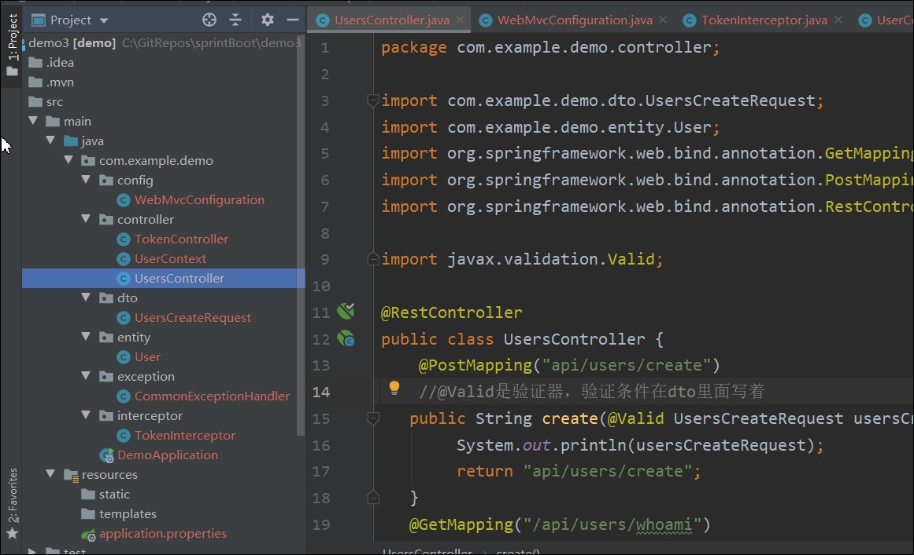

但是UserContext类中

```
private static User currentUser;
```

这是个静态变量，在所有线程共享数据，不是线程安全。

UserContext类改造如下：

```java
package com.example.demo.controller;

import com.example.demo.entity.User;

public class UserContext {
    private static final ThreadLocal<User> currentUser=new ThreadLocal<User>();
    public static void setUser(User user){
        currentUser.set(user);
    }
    public static User getUser(){
        return currentUser.get();
    }
}
```

这样的token拦截器，会拦截所有请求，查看token是否有效。对于一些不需要token的需要排除，不然响应不出正确的错误信息。

config包去修改配置

```java
interceptorRegistration.addPathPatterns("/api/**")
                //错误页面、user注册页面、token创建页面需要排除
                .excludePathPatterns("/error","/api/user/create","/api/token/create");
```


```java
package com.example.demo.config;

import com.example.demo.interceptor.TokenInterceptor;
import org.springframework.beans.factory.annotation.Autowired;
import org.springframework.context.annotation.Configuration;
import org.springframework.web.servlet.config.annotation.InterceptorRegistration;
import org.springframework.web.servlet.config.annotation.InterceptorRegistry;
import org.springframework.web.servlet.config.annotation.WebMvcConfigurer;
@Configuration//(6)配置文件加一个注解
//1）实现一个接口(WebMvcConfigurer)
public class WebMvcConfiguration implements WebMvcConfigurer {

    @Autowired//(3)，注入刚写的拦截器
    TokenInterceptor tokenController;
    //添加拦截器
    //（2）重写一个方法(addInterceptors),添加拦截器
    @Override
    public void addInterceptors(InterceptorRegistry registry) {
        //(4),拦截器添加到框架
        InterceptorRegistration interceptorRegistration = registry.addInterceptor(tokenController);
        //(5),配置对哪些路径生效
        interceptorRegistration.addPathPatterns("/api/**")
                //错误页面、user注册页面、token创建页面需要排除
                .excludePathPatterns("/error","/api/user/create","/api/token/create");
    }
}
```

其他的一些，需要用户个人信息的东西，比如用户订单。。这些，不能传id就获取，需要传token，token拦截器去验证是否存在，存在获取个人id，姓名等信息

通过

```
User user = UserContext.getUser();
```

获取进行后续操作。


# springboot整合kaptcha验证码

https://www.jianshu.com/p/1f2f7c47e812