# 1、post基础用法

## 1、post请求

<font color=red>RESTful风格通常url用复数形式</font>

### 1.1 x-www-form-rulencoded

form表单传递格式：x-www-form-rulencoded

对应

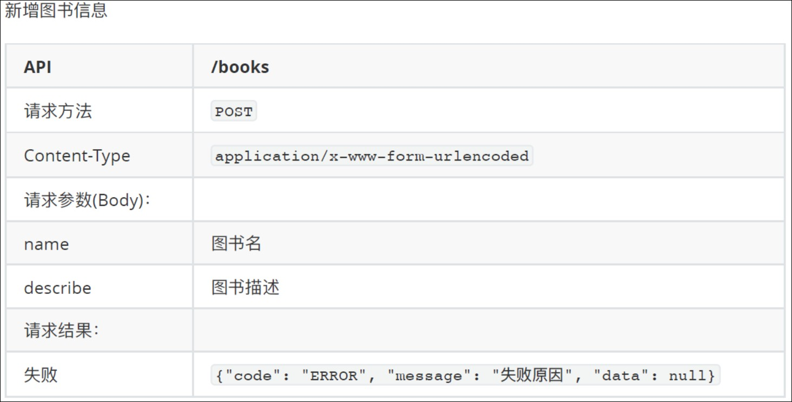

成功返回的数据如下:

```js
{
	"code": "SUCCESS",
	"message": null,
	"data": {
        "id": 1,
        "name": "书名1",
        "describe": "图书描述",
        "createdAt": "2020-02-17 14:39:07"
	}
}
```

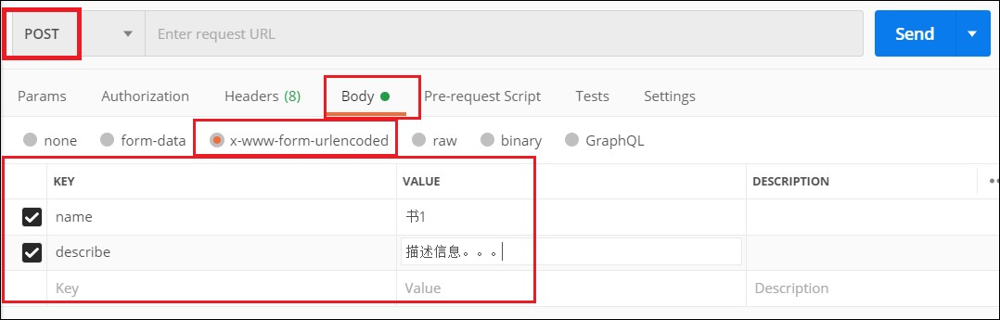

控制器中代码

```java
/**
 * 插入图书
 * @param name 图书名称
 * @param describe 图书详情
 * @return
 */
@PostMapping("/books")
public JsonResult<Book> createBook(String name,String describe){
    Book book=Book.builder()
            .name(name)
            .describe(describe)
            .createdAt(new Timestamp(new Date().getTime()))
            .build();
    bookMapper.insertBookByNameAndDescribe(book);
    System.out.println(book.getCreatedAt());
    return  new JsonResult<Book>(book);
}
```

mapper中代码

```java
/**
 * 插入图书
 * @param book 图书信息
 */
@Insert("INSERT INTO book (name,`describe`) values (#{name},#{describe})")
@Options(useGeneratedKeys = true,keyProperty = "id")
void insertBookByNameAndDescribe(Book book);
```

useGeneratedKeys原理

Mybatis 配置文件 useGeneratedKeys 参数只针对 insert 语句生效，默认为 false。当设置为 true 时，表示如果插入的表以自增列为主键，则允许 JDBC 支持自动生成主键，并可将自动生成的主键返回。


### 1.2 json格式

<font color=red>不能用form表单传递，实际开发中用的非常非常多</font>

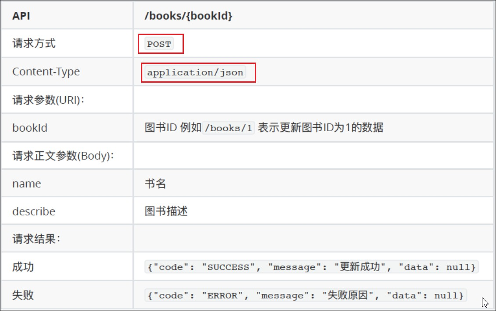

对应post请求


控制器代码

```java
/**
 * 更新图书
 * @param bookId 图书id
 * @param booksRequest 跟新内容
 * @return
 */
@PostMapping("/books/{bookId}")
public JsonResult  updateBooks(@PathVariable int bookId, @RequestBody BookRequest booksRequest){
    System.out.println(bookId);
    System.out.println(booksRequest);
    System.out.println("bookController");
    int isUpdate=bookMapper.updateBooks(bookId,booksRequest);

    if(isUpdate==1){
        return new JsonResult("SUCCESS","更新成功");
    }
    if(isUpdate==0){
        return new JsonResult("ERROR","id不存在");
    }
    return null;
}
```

BookRequest代码

```java
@Data
@NoArgsConstructor
@AllArgsConstructor
@Builder
public class BookRequest {
    private String name;
    private String describe;
}
```

mapper中的代码

```java
/**
 * 更新图书
 * @param bookId 跟新图书的id
 * @param bookRequest 跟新图书的具体信息
 * @return 更新图书的条数，没有更新返回0
 */
@Update("UPDATE book SET name=#{bookRequest.name},`describe`=#{bookRequest.describe} WHERE id=#{bookId}")
int updateBooks(int bookId, @Param("bookRequest")BookRequest bookRequest);
```

<font color=red>###注意点###</font>

1、update中set后的多对信息，用逗号(,)隔开，不是and

## 2、get请求

请求参数(QueryParams)：
		例如 /books?name=java&page=2&limit=5

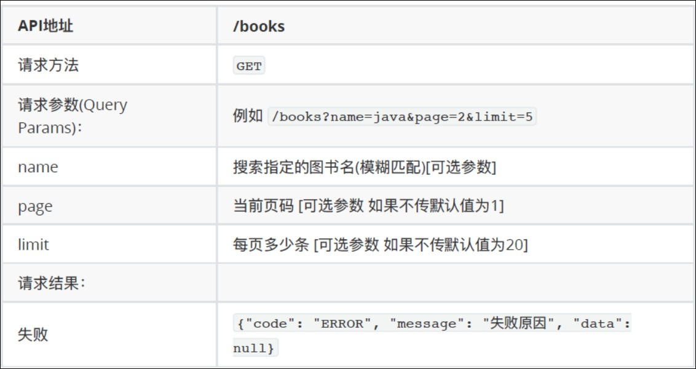

成功返回的数据如下

```js
{
	"code": "SUCCESS",
	"message": null,
	"data": {
		"pagination": { //⻚码信息
			"total": 2, //共有多少条数据
			"page": 1, //当前是第⼏⻚
			"limit": 5, //每⻚多少条数据
		},
		"books": [ //图书数据
			{
				"id": 1,
				"name": "书名1",
				"createdAt": "2020-02-17 14:39:07"
			},
			{
				"id": 2,
				"name": "书名2",
				"createdAt": "2020-02-17 14:39:07"
			}
		]
	}
}
```


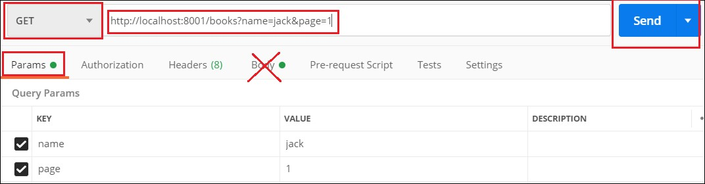

控制器中代码

```java
/**
 *  查找图书列表
 * @param name 图书名字
 * @param pagination 分页信息
 * @return
 */
@GetMapping("/books")
public JsonResult Books(String name,Pagination pagination){
    //获取符合条件的总记录数，用于分页
    Book book=Book.builder().name(name).build();
    pagination.setTotal(bookMapper.count(book));

    //分页查询数据
    List<Book> books=bookMapper.selectBooks(book,pagination);

    Map<String,Object> data=new HashMap<String,Object>();
    data.put("pagination",pagination);
    data.put("books",books);
    return new JsonResult(data);
}
```

mapper中代码

```java
/**
 * 给定条件图书的数量
 * @param book 查询图书的条件
 * @return 符合条件的图书数量
 */
@Select("<script>"+
        "SELECT COUNT(*) FROM book"+
        "<where>"+
        "<if test='book.name!=null'> AND name LIKE CONCAT('%',#{book.name},'%')</if>"+
        "<if test='book.id!=0'> AND id=#{book.id}</if>" +
        "</where>"+
        "</script>")
int count(@Param("book") Book book);
```

```java
/**
 *  查询图书列表
 * @param book 查询图书的信息
 * @param pagination 分页信息
 * @return 图书列表
 */
@Select("<script>"+
        "SELECT * FROM book"+
        "<where>"+
        "<if test='book.name!=null'> AND name LIKE CONCAT('%',#{book.name},'%')</if>"+
        "</where>"+
        "ORDER BY id DESC"+
        " LIMIT #{pagination.offset},#{pagination.limit}"+
        "</script>"
)
List<Book> selectBooks(@Param("book") Book book, @Param("pagination") Pagination pagination);
```

# 2、post和idea配合，响应数据

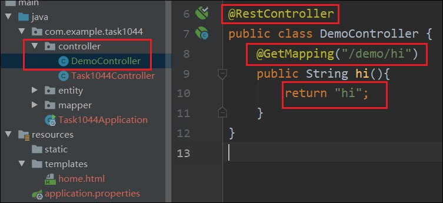

#### <font color=red>控制器叫什么名字（demo），url前面字段就叫啥，方法叫什么名字（hi），url后面字段就叫啥</font>

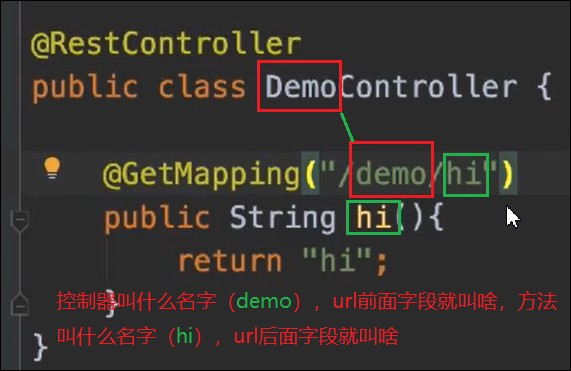

### 2.1 响应单个数据

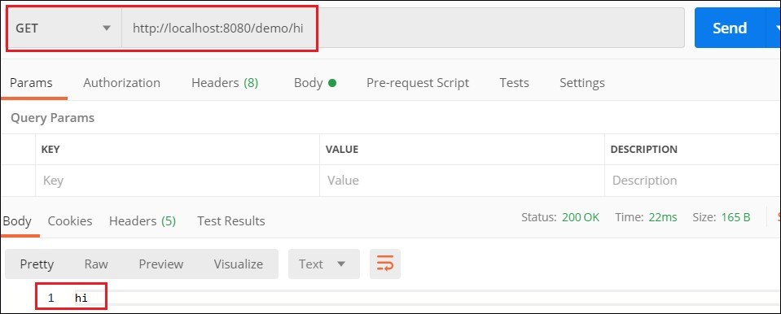

```java
@GetMapping("/demo/getBook")
public Book getBook(){
    Book book=new Book();
    book.setId(1);
    book.setName("java编程思想");
    book.setPrice(new BigDecimal(25.00));
    book.setDescribe("hello,你好");
    return book;
}
```

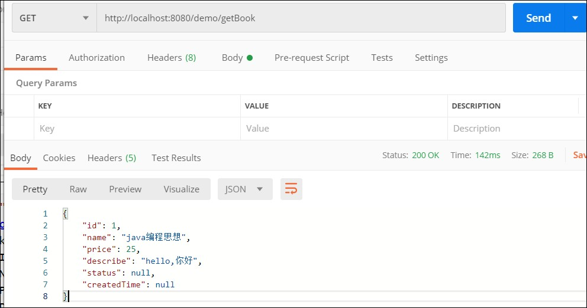

浏览器也可以访问结果如下

http://localhost:8080/demo/getBook

```js
{"id":1,"name":"java编程思想","price":25,"describe":"hello,你好","status":null,"createdTime":null}
```


### 2.2 Builder()

```java
@Data//get ,set,toString,hashCode,equals
@Builder//可以随意赋值，不是全参的时候，不用一个一个去set
@NoArgsConstructor//无参构造
@AllArgsConstructor//全参构造
public class Book {
    private int id;//图书id
    private String name;//图书名称
    private BigDecimal price;//图书单价
    private String describe;//图书描述
    private String status;//状态
    private Timestamp createdTime;//创建时间
}
```

```java
    @GetMapping("/demo/getBook")
    public Book getBook(){
        Book book=Book.builder().id(1).name("java编程思想").price(new BigDecimal(23)).build();
        return book;
    }
```

### 2.3 响应集合

```java
    @GetMapping("/demo/getBooks")
    public List<Book> getBooks(){
        List<Book> bookList=new ArrayList<>();
        bookList.add(Book.builder().id(1).name("java编程思想").price(new BigDecimal(23)).build());
        bookList.add(Book.builder().id(2).name("c语言入门教程").price(new BigDecimal(25)).build());
        return bookList;
    }
```

postman返回数据

```js
[
    {
        "id": 1,
        "name": "java编程思想",
        "price": 23,
        "describe": null,
        "status": null,
        "createdTime": null
    },
    {
        "id": 2,
        "name": "c语言入门教程",
        "price": 25,
        "describe": null,
        "status": null,
        "createdTime": null
    }
]
```


### 2.4 响应状态码错误消息

建一个util包，下面一个Result类

```java
package com.example.task1044.util;
import lombok.AllArgsConstructor;
import lombok.Getter;

@Getter
@AllArgsConstructor
public class Result {
    private String code;
    private String message;
    private String data;
}
```

控制器中建Result

```java
@GetMapping("/demo/getResult")
public Result getResult(){
    Result result= new Result("SUCCESS","请求数据成功","啦啦啦");
    return result;
}
```

postman 返回数据

```javascript
{
    "code": "SUCCESS",
    "message": "请求数据成功",
    "data": "hahaha"
}
```


### 2.5 Data改为泛型

#### 1、一个对象

```java
@Getter
@AllArgsConstructor
public class Result<T> {
    private String code;
    private String message;
    private T data;
}
```


```java
    @GetMapping("/demo/getResult")
    public Result<Book> getResult(){

        Book book=Book.builder().id(1).name("java编程思想").price(new BigDecimal(23)).build();
        Result result= new Result<Book>("SUCCESS","请求数据成功",book);
        return result;
    }
```

postman返回数据

```js
{
    "code": "SUCCESS",
    "message": "请求数据成功",
    "data": {
        "id": 1,
        "name": "java编程思想",
        "price": 23,
        "describe": null,
        "status": null,
        "createdTime": null
    }
}
```


#### 2、一个集合

```java
@Getter
@AllArgsConstructor
public class Result<T> {
    private String code;
    private String message;
    private T data;
}
```


```java
@GetMapping("/demo/getResult2")
public Result<List<Book>> getResult2(){
    List<Book> bookList=new ArrayList<>();
    bookList.add(Book.builder().id(1).name("java编程思想").price(new BigDecimal(23)).build());
    bookList.add(Book.builder().id(2).name("c语言入门教程").price(new BigDecimal(25)).build());
    Result result= new Result<List<Book>>("SUCCESS","请求数据成功",bookList);
    return result;
}
```

postman返回数据

```js
{
    "code": "SUCCESS",
    "message": "请求数据成功",
    "data": [
        {
            "id": 1,
            "name": "java编程思想",
            "price": 23,
            "describe": null,
            "status": null,
            "createdTime": null
        },
        {
            "id": 2,
            "name": "c语言入门教程",
            "price": 25,
            "describe": null,
            "status": null,
            "createdTime": null
        }
    ]
}
```

# 3、接收参数

<font color=red> 接收参数，既可以是Json，也可以是x-www-form-urlencoded</font>

<font color=red>同一个项目中，尽量用同一种接收方式，前端方便</font>

## 3.1 get请求

### 3.1.1 普通参数(HttpServletRequest接收)

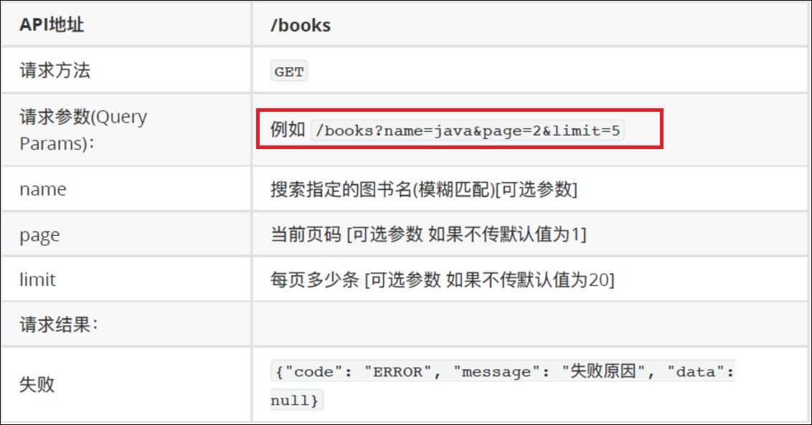

java控制器中代码：

```java
@RestController
public class DemoController {
    @GetMapping("/demo/params")
    public String params(HttpServletRequest request){
        System.out.println("id："+request.getParameter("id"));
        System.out.println("name:"+request.getParameter("name"));
        return "hi";
    }
}
```

postman请求

http://localhost:8080/demo/params?id=1&name=jack

控制台打印输出

```
id：1
name:jack
```

### 3.1.2 简单的方法（直接用String name，int id接收）

```java
@RestController
public class DemoController {
    @GetMapping("/demo/params")
   public String params(int id,String name){
        System.out.println("id："+id);
        System.out.println("name:"+name);
        return "hi";
    }
}
```

postman请求

http://localhost:8080/demo/params?id=2&name=marry

控制台打印输出

```
id：2
name:marry
```

### 3.1.3 dto参数，

Data Transfer Object，数据传输对象

#### 3.1.3.1新建包dto，新建类DemoRequest.java

```java
package com.example.task1044.dto;

import lombok.AllArgsConstructor;
import lombok.Builder;
import lombok.Data;
import lombok.NoArgsConstructor;

@Data
@NoArgsConstructor
@AllArgsConstructor
@Builder
public class DemoRequest {
    private String name;
    private int age;
    private int limit;
}
```

#### 3.1.3.2 控制器编码

```java
@GetMapping("/demo/params")
public String params(DemoRequest demoRequest){
    System.out.println(demoRequest);
    return "hi";
}
```

#### 3.1.3.3 postman的get请求

http://localhost:8080/demo/params?id=2&name=marry&limit=3

#### 3.1.3.4 控制台打印输出

```
DemoRequest(name=marry, age=0, limit=3)
```

### 3.1.3.4 三种方法可以混合使用

#### 3.4.1 控制器代码

```java
@GetMapping("/demo/params")
public String params(DemoRequest demoRequest,String name,HttpServletRequest request){
    System.out.println(demoRequest);
    System.out.println(name);
    System.out.println(request.getParameter("content"));
    return "hi";
}
```

#### 3.4.2 postman请求

http://localhost:8080/demo/params?id=2&name=marry&limit=3&content=hello

#### 3.4.3 控制台打印输出

```
DemoRequest(name=marry, age=0, limit=3)
marry
hello
```

## 3.2 post请求

### 3.2.1 x-www-form-urlencoded格式

控制器代码

```java
@PostMapping("/demo/paramsPost")
public String paramsPost(DemoRequest demoRequest){
    System.out.println(demoRequest);
    return "hi";
}
```

postman 请求

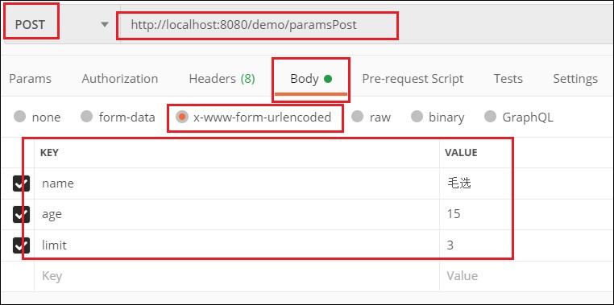

控制台输出

```
DemoRequest(name=毛选, age=15, limit=3)
```

### 3.2.2 格式 JSON

控制器代码

加注解：<font color=red>@RequestBody参数</font>

```java
@PostMapping("/demo/paramsPost2")
public String paramsPost2(@RequestBody DemoRequest demoRequest){
    System.out.println(demoRequest);
    return "hi";
}
```

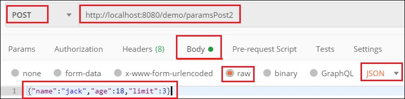

<font color=red>JSON代码注意加“name”</font>

```json
{"name":"jack","age":18,"limit":3}
```

控制台输出

```java
DemoRequest(name=jack, age=18, limit=3)
```

## 3.3 url后面直接跟参数。例：books/{bookId}

这个请求方式既可以post，get、delete

控制器代码           <font color=red>@PathVariable</font>

```java
@PostMapping("/demo/book/{bookId}")
public String paramsPost2(@PathVariable String bookId){
    System.out.println(bookId);
    return "hi";
}
```

postman请求


控制台输出

```
1002
```

# 4、myBatic操作

查

```java
@Select("SELECT * FROM book WHERE id=#{id} LIMIT=1")

Book findBookById(@Param("id") int id);
```

增

```java
@Insert("INSERT INTO book (name,`describe`) VALUES (#{name},#{describe})")
@Options(userGeneratedKeys=true,keyProperty="id")

void insert (Book book);	
```

改

```java
@Update("UPDATE book SET name=#{book.name},`describe`=#{book.describe} WHERE id=#{id}")

int update(@Param("id") int bookId,@Param("book") Book book);
```

删

```java
@Delete("DELETE FROM book WHERE id=#{id}")

int delete(@Param("id") int id);
```


select * from book where id in (1,3,5);

查询第一页，五条

```mysql
select * from book where limit 0,5;
```

查询第二页，五条

```mysql
select * from book where limit 5,5;
```

查询第三页，五条

```mysql
select * from book where limit 10,5;
```

mysql的concat函数

```mysql
select * from book where name like concat ('%','java','%')		
```


```java
//MyBatis会自动处理WHERE后紧跟的多余AND
@Select("<script"+
         "SELECT * FROM book"+
         "<where>"+
         "<if test='book.name!=null'>AND name LIKE CONCAT ('%',#{book.name},'%')</if>"+
         "<if test='book.id!=0'>AND id=#{book.id}</if>"+
         "</where>"+
         "ORDER BY id DESC"+
         "LIMIT #{pagination.offset},#{pagination.limit}"+
         "</script>")
List<Book> findBooks(@Param("book") Book book,@Param("pagination") Pagination pagination);
```

时间格式转换

配置文件中加一句

```properties
spring.jackson.date-format=yyyy-MM-dd HH:mm:ss
spring.jackson.time-zone=GMT+8
```

# 跨域

整个Controller都支持跨域访问，在类上面加上注解@CrossOrigin，如下：

Java代码  收藏代码

```java
@Controller  
@CrossOrigin  
public class TestController {  
    ……  
    ……  
} 
```

